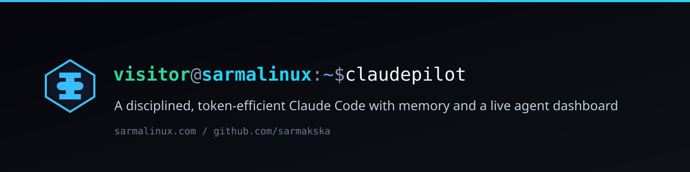
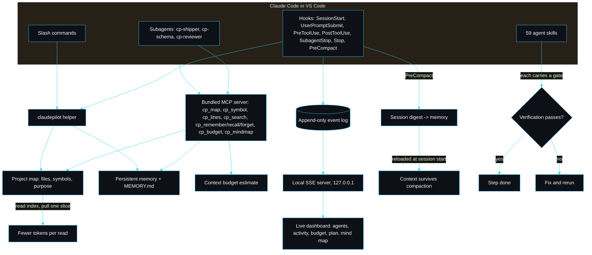

<p align="center"></p>

<h1 align="center">claudepilot by sarmalinux</h1>

<p align="center">A Claude Code plugin that works through precise tools instead of whole-file reads, keeps context across compaction, and shows you the agents and the budget while they run.</p>

<p align="center">
<a href="./LICENSE"></a>
<a href="https://github.com/sarmakska/claudepilot"></a>
<a href="https://github.com/sarmakska/claudepilot/commits/main"></a>
</p>

A long Claude Code session usually dies one of two ways. Either it reads whole files until the context window is full and starts forgetting the start of its own plan, or it does good work and then the session ends and every decision it made evaporates. claudepilot is a Claude Code plugin I built to stop both, and to let me actually see what the agent is doing while it does it.

You install it into Claude Code in VS Code. It is not a CLI you run as a product; there is a small helper binary the plugin shells out to from its hooks, its slash commands and a bundled MCP server, but you never invoke it directly.

## What you feel on day one

Four things change the moment claudepilot is installed and a project is open.

1. **Claude works through precise tools, not whole-file reads.** A bundled MCP server (`src/mcp`) exposes `cp_map`, `cp_symbol`, `cp_lines` and `cp_search`. Claude orients with the map and pulls one symbol or one line range, so a single `cp_symbol` call replaces opening the whole file. The worked numbers are below.
2. **Context survives compaction.** A `PreCompact` hook (`hooks/pre-compact.mjs`) writes a structured digest of the session (open task, decisions, files touched, next steps) to the memory store the instant before Claude Code compacts. The next session reloads that digest, so the thread is not lost when the window is trimmed.
3. **You watch the agents in a local dashboard.** Session start boots a `127.0.0.1` server and prints the URL into the chat. You glance at a tab and see which agent is on which step.
4. **You see the budget in the statusline.** The status bar shows `cp | ctx 12% ok | mem 4 | skill scoped-read`, so the context budget, the memory count and the active skill are always in view.

## Why I built this

I ship small production sites on Cloudflare, Supabase, Vercel and Resend, and I lean on Claude Code to do the boring parts. The pattern that kept biting me was the long session. Claude would open a 1,200 line component to change one prop, the budget would bleed, and three prompts later it had paged out the convention we agreed on at the top. When I compacted, the durable facts went with the noise. I tried writing everything into CLAUDE.md by hand and it rotted within a day.

So I wrote claudepilot around two habits I wanted enforced rather than remembered: read a compact map and pull a slice instead of reading whole files, and write durable facts to a structured store that survives a compaction. Then I added the thing I actually wanted most, which was a window into the session. When you fire off a plan and a subagent and walk away, you should be able to glance at a tab and see which agent is on which step and how much budget is left. That is pillar five, the live dashboard, and it is the headline feature.

## Watch the agents work

The headline feature. When a session starts, claudepilot's `SessionStart` hook boots a small local server, binds `127.0.0.1` on a free port, and prints the URL into the chat:

```
Live agent dashboard: http://127.0.0.1:53267 (just started)
It streams this session locally; nothing leaves the machine.
```

Open it and you get four live panels, themed in the SarmaLinux palette:

- **Agents.** Every agent and subagent, its status (running, waiting, done, failed), and the task it is on.
- **Discussion / activity.** The per-agent stream of prompts, tool calls and results as they land, grouped so a subagent's work does not tangle with the main thread.
- **Token budget.** A bar that fills as reads pull bytes into context, so you can see headroom before compaction bites.
- **Plan and mind map.** The current plan and a Mermaid map of the session's agents, redrawn as events arrive.

How it is wired, end to end: each lifecycle hook (`SessionStart`, `UserPromptSubmit`, `PreToolUse`, `PostToolUse`, `SubagentStop`, `Stop`) appends one JSON event to an append-only log under `.claude/claudepilot/dashboard/<session>.jsonl`. The server tails that log and pushes folded state to the browser over server-sent events. Because the log is the source of truth, the dashboard can also **replay** a finished session, not just watch a live one. The session picker in the header switches between recorded sessions.

It is honest about what it is: a local observability dashboard for your session. It watches and visualises the agents, it does not drive them. Nothing leaves the machine, there is no telemetry, the bind is local only, and obvious secrets are redacted before they ever reach the log. Auto-open is on by default and lives behind a setting:

```jsonc
// .claude/claudepilot/dashboard.json
{ "enabled": true, "autoOpen": false }
```

Or per session: `CLAUDEPILOT_DASHBOARD=0` disables it, `CLAUDEPILOT_DASHBOARD_OPEN=0` keeps the browser shut. Starting is idempotent, so a resume or a reload reuses the running server rather than spawning a second.

## Before and after: a real token example

The distinctive thing claudepilot changes is the shape of a read. Here is a real one from this repository: a task that needs the body of `retrieveSymbol` in `src/map/retrieve.ts`. The token figures use claudepilot's own conservative 3.6 bytes-per-token estimate (`src/context/budget.ts`), computed by running the helper on this machine (Apple Silicon, Node 25):

```
$ wc -c src/map/retrieve.ts
    4841 src/map/retrieve.ts          # whole file: 4,841 bytes, ~1,345 tokens

$ node dist/cli/index.js slice . src/map/retrieve.ts retrieveSymbol | wc -c
    1381                              # cp_symbol slice: 1,381 bytes, ~384 tokens
```

| Approach | Bytes into context | Approx tokens | Saving |
|---|---|---|---|
| Whole-file `Read` of `retrieve.ts` | 4,841 | ~1,345 | baseline |
| `cp_symbol(retrieve.ts, retrieveSymbol)` | 1,381 | ~384 | **71% fewer** |

That gap widens with file size. Orienting in the whole `src/` tree by reading every file is about 40,597 tokens (146,150 bytes); reading the `cp_map` index instead is about 2,173 tokens (7,821 bytes), **5.4% of reading everything**. The dashboard's token-budget bar makes this visible while it happens: with the tools on, the bar crawls; with whole-file reads, it lurches.

## The MCP tools

The bundled MCP server (declared in `.claude-plugin/plugin.json` under `mcpServers`, served over stdio by `dist/mcp/index.js`) is the biggest single token win. Claude Code loads it automatically. The tools:

| Tool | What it returns |
|---|---|
| `cp_map` | the compact project map (files, exported symbols, purpose). No file contents. |
| `cp_symbol(file, symbol)` | just that symbol's source slice, with its doc comment. |
| `cp_lines(file, start, end)` | exactly that line range. |
| `cp_search(query)` | ranked file locations for a query. Locations, not contents. |
| `cp_remember` / `cp_recall` / `cp_forget` | the memory store as tools. |
| `cp_budget()` | the context-budget level (ok/warn/compact) and a token estimate. |
| `cp_mindmap()` | the project as a themed Mermaid mind map. |

Every tool returns the smallest correct thing; `cp_symbol` never returns the whole file. That discipline lives in `src/mcp/tools.ts` where it cannot be bypassed.

## Lossless compaction and smart recall

The two memory features that make a long session survivable.

**Lossless compaction.** Claude Code fires `PreCompact` just before it summarises and trims the conversation, which is exactly the moment the thread tends to blur. claudepilot's hook reconstructs what happened from the dashboard event log, builds a structured digest (open task, decisions, files touched, next step) in `src/memory/digest.ts`, and writes it to the store as a durable fact. On the next session start it is reloaded first, so a resumed session picks up where it left off rather than from a lossy summary.

**Smart recall, not load-everything.** A naive memory layer dumps the whole store back into context every session, which costs more tokens the larger it grows. claudepilot instead builds a task signal from the git branch, the files changed in the working tree and the last prompt, ranks memories against it (`src/memory/recall.ts`), and reloads only the relevant subset under a hard ~1,200 token ceiling, plus the `MEMORY.md` index for the rest. With no signal it loads nothing and defers to the index, because loading arbitrary memories with no signal is the behaviour we are avoiding.

## The statusline and the terse output style

The plugin ships a statusline command (`statusline/claudepilot-statusline.mjs`, declared under `statusLine` in the manifest) that renders one line in the Claude Code status bar:

```
cp | ctx 12% ok | mem 4 | skill scoped-read | Opus 4.8
```

Context budget level, durable memory count, active skill, model. The formatting is pure and unit-tested (`src/statusline`). It also ships an output style, `output-styles/claudepilot.md`, tuned for terse, high-signal answers; switch to it with `/output-style claudepilot` to spend fewer tokens per turn.

## Shipped subagents

Three lean, token-disciplined subagents under `agents/`, each using the MCP tools rather than whole-file reads:

- **cp-shipper.** Takes a site from scaffold to deployed across the integration skills, running each verification gate and refusing to advance past a red one.
- **cp-schema.** Designs and migrates a Supabase/Postgres schema with row level security that denies by default.
- **cp-reviewer.** A pre-push guardrail: lint, build, tests and a secret scan, with a clear FAIL verdict that blocks the push.

Delegate with the Task tool, for example "use cp-reviewer to check this before I push".

## /claudepilot:doctor

After install, run `/claudepilot:doctor`. It checks the whole install end to end (MCP server built and declared, every hook including `PreCompact` wired, the memory store reachable, the helper CLI built, the statusline, output style and subagents present, the plugin manifest valid) and prints a `PASS`/`FAIL` line per check, so you know it is working.

## Install in VS Code and go

You need Claude Code running in VS Code and Node 20 or newer on your PATH (the hooks and helper run on Node).

```
/plugin marketplace add sarmakska/claudepilot
/plugin install claudepilot
```

Open your project. At session start the dashboard boots, the memory index loads, and Claude is nudged to read the map before whole files. Build the map once so reads stay scoped:

```
/claudepilot:map
```

Then work as normal. Verify the install with `/claudepilot:doctor`, save durable decisions with `/claudepilot:remember`, recall them with `/claudepilot:recall`, and check the plan, budget and mind map with `/claudepilot:status`.

## Architecture



## The five pillars

1. **Token efficiency.** A compact, regenerable map of files, exported symbols and purpose (`src/map`), exposed through the bundled MCP server (`src/mcp`) as `cp_map`, `cp_symbol`, `cp_lines` and `cp_search`. Claude reads the map and one slice, not whole files. The `PreToolUse` hook warns before a large whole-file read; `UserPromptSubmit` reminds it to use the map and recall memory. A budget estimate (`src/context/budget.ts`) tracks approximate usage and says when to compact.
2. **Persistent memory, with lossless compaction.** A file-based store under `.claude/claudepilot/memory/`: one fact per file with frontmatter, plus a regenerated `MEMORY.md` index (`src/memory`). The `PreCompact` hook writes a session digest before compaction; `SessionStart` reloads that digest plus a signal-ranked relevant subset (branch, changed files, last prompt), never the whole store. `Stop` nudges Claude to write durable facts.
3. **Guardrailed skill library.** 59 skills across frontend, backend, Supabase, Cloudflare, Vercel, Resend, auth, payments, SEO, analytics, git/release, plus memory and context discipline. Each is a real agent skill with a `SKILL.md`; each shipping skill carries a verification gate, a check the agent runs to prove the step worked. `claudepilot plugin-validate` fails loudly on anything malformed.
4. **Mind map and status in the chat.** `/claudepilot:mindmap` renders the project as a themed Mermaid diagram in chat or a self-contained HTML artifact (`src/dashboard/artifact.ts`). `/claudepilot:status` shows the plan, the budget with a recommendation, the memory count and the map.
5. **Live agent dashboard.** The auto-launching local observability dashboard described above (`src/dashboard`). Hooks to event log to local server to live UI, with replay.

## Design decisions

A few choices I made deliberately, and the alternatives I turned down.

**A hand-rolled MCP server, not the SDK.** I bundle the MCP server (`src/mcp/server.ts`) as a small JSON-RPC-over-stdio loop rather than depending on `@modelcontextprotocol/sdk`. The slice of the protocol Claude Code drives is tiny and stable (initialize, tools/list, tools/call), and a plugin that bundles a server should add as little to a user's install as possible. The cost is that I implement the framing myself; the benefit is zero runtime dependencies on the MCP path and a server I can audit in one file. The request handler is pure and exported, so the tests drive it without a process, and a separate test spawns the real binary over stdio.

**Signal-ranked recall, not load-everything.** The obvious memory design reloads the whole store each session. I rejected it because it gets more expensive the more useful the store becomes. Recall instead ranks against a cheap task signal and reloads only the subset that fits a token budget. With no signal it loads nothing, because loading arbitrary facts with no signal is the very thing I was trying to avoid.

**Server-sent events, not a websocket.** The dashboard traffic is one-directional, server to browser. SSE is a handful of lines over plain HTTP and the browser reconnects on its own. A websocket would buy me a duplex channel I do not need and a dependency that could break the plugin build. The browser never has to tell the server anything except which session to watch, and that fits in a query string.

**node:http, not Express.** The server serves one page, two JSON routes and an event stream. Pulling in Express (and its tree) to do that is weight I would have to keep secure and in sync with the rest of the plugin. The standard library does it in one file (`src/dashboard/server.ts`). The cost is that I write the tiny router by hand, which is a price worth paying for zero runtime dependencies on the server path.

**An append-only JSONL log, not a database.** I considered SQLite for the event store. It would give me indexes and queries I do not need, and a native module that complicates packaging a plugin meant to install cleanly everywhere. A line-per-event JSONL file is append-only by construction, trivially tailable, human-readable when something goes wrong, and it makes replay free: state is a pure fold over the log. The trade-off is that I do my own concurrency control with a small advisory lock so two racing hook processes never pick the same sequence number; that is in `src/dashboard/log.ts` and it is tested under 25 parallel writers.

**A byte-count budget estimate, not a real token meter.** claudepilot cannot read Claude Code's internal token counter, so it estimates from bytes pulled into context at a cautious 3.6 bytes per token. This is guidance, not a guarantee, and the wording everywhere says so. I would rather be honestly approximate and conservative (compact a little early) than precise-looking and wrong.

## Limitations and non-goals

- The token budget is an **estimate**, not the real counter. It is tuned to warn early. Treat the percentages as a strong hint, not gospel.
- The dashboard **observes**; it does not control the agents. It cannot pause a tool call or steer a subagent. That is by design.
- Subagent visibility depends on what Claude Code exposes. There is a reliable `SubagentStop`, so the dashboard infers a subagent from the first event that names it and flips its status on stop. If a future Claude Code adds a real `SubagentStart`, I will wire it.
- The skill library targets the stack I actually ship on (Cloudflare, Supabase, Vercel, Resend). It is **not** trying to be a universal scaffolder for every framework.
- Secret redaction is blunt and pattern-based. It will mask things that are not secrets before it lets a real one through, which is the safe direction, but do not treat it as a vault.

## Roadmap

What I intend to add: a compaction timeline on the dashboard so you can see where the session was offloaded and replayed; an optional per-agent diff view; export of a session log as a shareable HTML artifact (same shape as the mind map artifact). What I will not add: a hosted/cloud version (this stays local-only on purpose), accounts, or any telemetry. If it phones home, it is not claudepilot.

## Development

This repository is both the published plugin and the helper it calls.

```
pnpm install --frozen-lockfile
pnpm build
pnpm lint
pnpm test
pnpm validate
pnpm plugin-validate
```

The suite is 88 tests across 11 files; on Apple Silicon (Node 25) `pnpm test` runs them in about 2.1s. Beyond the dashboard tests (event validity, the concurrency-safe append-only writer under 25 parallel writers, a real SSE server end to end, idempotent start, replay), the suite spawns the real MCP server over stdio and asserts `tools/list` and a `cp_symbol` call return correct, minimal output; checks the PreCompact digest builds and reloads; checks signal-ranked recall returns only the relevant subset within budget; pins the statusline string; and runs doctor against both the real tree and a deliberately broken one.

The wiki has the full write-up: [Home](https://github.com/sarmakska/claudepilot/wiki) . [Architecture](https://github.com/sarmakska/claudepilot/wiki/Architecture) . [MCP-Tools](https://github.com/sarmakska/claudepilot/wiki/MCP-Tools) . [Lossless-Compaction](https://github.com/sarmakska/claudepilot/wiki/Lossless-Compaction) . [Memory-Recall](https://github.com/sarmakska/claudepilot/wiki/Memory-Recall) . [Subagents](https://github.com/sarmakska/claudepilot/wiki/Subagents) . [Statusline](https://github.com/sarmakska/claudepilot/wiki/Statusline) . [Output-Style](https://github.com/sarmakska/claudepilot/wiki/Output-Style) . [Live-Agent-Dashboard](https://github.com/sarmakska/claudepilot/wiki/Live-Agent-Dashboard) . [Token-Efficiency](https://github.com/sarmakska/claudepilot/wiki/Token-Efficiency) . [Skill-Engine](https://github.com/sarmakska/claudepilot/wiki/Skill-Engine) . [Skill-Catalogue](https://github.com/sarmakska/claudepilot/wiki/Skill-Catalogue) . [Writing-a-Skill](https://github.com/sarmakska/claudepilot/wiki/Writing-a-Skill) . [Hooks](https://github.com/sarmakska/claudepilot/wiki/Hooks) . [Install-in-VS-Code](https://github.com/sarmakska/claudepilot/wiki/Install-in-VS-Code) . [FAQ](https://github.com/sarmakska/claudepilot/wiki/FAQ) . [Troubleshooting](https://github.com/sarmakska/claudepilot/wiki/Troubleshooting) . [Roadmap-and-Limitations](https://github.com/sarmakska/claudepilot/wiki/Roadmap-and-Limitations)

---
Built by Sarma. Part of the SarmaLinux open-source line.
Website: https://sarmalinux.com . GitHub: https://github.com/sarmakska
