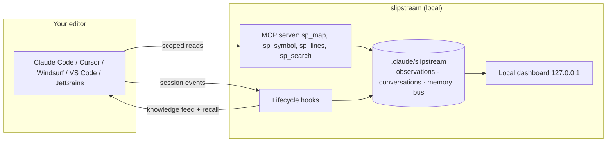
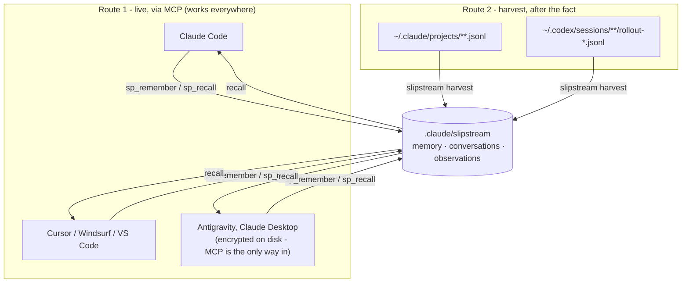
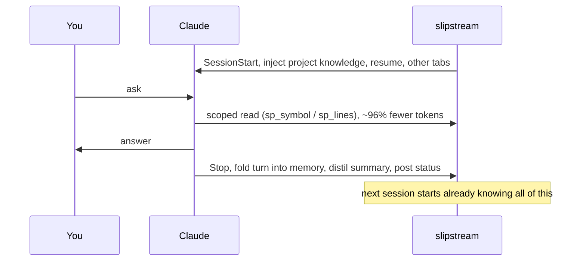
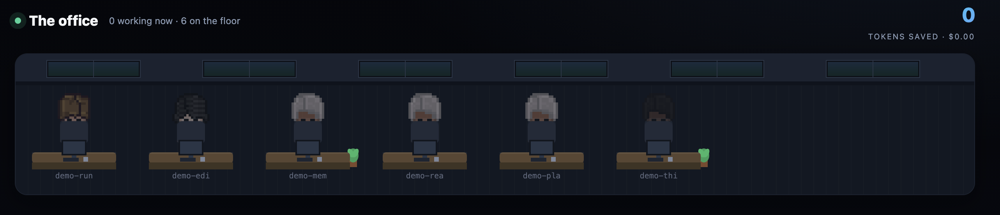

<h1 align="center">slipstream by sarmalinux</h1>

<p align="center">The local memory and observability layer for Claude Code. Claude remembers across sessions, reads far fewer tokens, and you can see everything it did.</p>

<p align="center"><em>slipstream is not affiliated with or endorsed by Anthropic. Claude and Claude Code are trademarks of Anthropic, referenced here only to describe compatibility.</em></p>

<p align="center">
<a href="https://github.com/sarmakska/slipstream/actions/workflows/ci.yml"></a>
<a href="https://github.com/sarmakska/slipstream/releases"></a>


<a href="./LICENSE"></a>
</p>

A long Claude Code session dies one of two ways: it reads whole files until the context window is full and forgets the start of its own plan, or it does good work and then the session ends and every decision evaporates. slipstream stops both, and lets you watch what the agent did while it did it. It installs as a Claude Code plugin and also runs as an MCP server inside Cursor, Windsurf, Antigravity, VS Code and JetBrains. Everything is local, gitignored, and never leaves your machine.

## What you actually get

- **Claude remembers across sessions.** Every turn is folded into a local observation; each session is distilled into a durable summary automatically, no `remember` call needed. The next session starts knowing what the last one did.
- **Cold start is never cold.** On every session start slipstream injects a freshly built knowledge feed: what the project is, how it is organised, the most-connected files to read first, what was recently asked, and what is remembered. Claude opens oriented instead of blank.
- **~95% fewer tokens per read, and it is reproducible.** Instead of opening whole files, Claude pulls one symbol or one line range through the scoped map. `pnpm benchmark` measures it on real files and prints a table you can regenerate. This is per-read efficiency, not end-to-end; the script says so plainly.
- **Multiple tabs coordinate.** Open several Claude Code sessions on one project and each posts what it is working on to a shared local bus; every session sees the others at its next turn and builds on their work instead of duplicating it. This is turn-boundary coordination, not live mid-turn messaging, which the platform does not allow.
- **A local dashboard that shows the real work.** The home view is a live pixel office where every open Claude Code tab is a character at a desk, animated by what it is doing right now, with tokens saved as the hero figure. Alongside it: digest-first sessions, what slipstream has learned, and an interactive code-dependency graph — all on `127.0.0.1`, fed by your actual sessions.
- **One memory across every AI client you use.** Memory is stored per project, not per tool. Register slipstream as an MCP server in any client and it writes to the same store as it works; run `slipstream harvest` and it folds in conversations other clients already wrote to disk — Claude Code and Codex CLI today. Something you worked out in one tool is recallable from the next. See [docs/cross-client-memory.md](docs/cross-client-memory.md).
- **It tells you when it is out of date, and Claude offers to fix it.** A new release surfaces in the session feed with the exact update command, so you find out inside the work rather than months later. One cached request a day, silent offline, off with SLIPSTREAM_NO_UPDATE_CHECK=1.
- **Skills that make Claude work deliberately.** 78 shipped skills, including a methodology set (`using-slipstream`, `test-driven-development`, `verification-before-completion`, `executing-plans`, `dispatching-parallel-agents`, `using-git-worktrees`, code review, `finishing-a-branch`) and a premium web-design track.

## How it fits together



Everything in the dashed box is on your machine. No cloud, no telemetry, no account.

The one exception, stated plainly: **slipstream makes a single network call** — an unauthenticated GET to the npm registry, at most once a day, to see whether a newer version has been published. Nothing about you, your code or your sessions is sent, and nothing is ever uploaded. It fails silently when you are offline, and `SLIPSTREAM_NO_UPDATE_CHECK=1` turns it off entirely.

## One memory, every client

The store belongs to the **project**, not to the tool you happened to open. Two routes fill
it, and you generally want both:



Route 1 captures the reasoning as it happens, in any MCP-capable client. Route 2 sweeps up
transcripts that clients already wrote to disk, so history predating slipstream is
searchable too. Full detail, including which clients cannot be harvested and why, is in
[docs/cross-client-memory.md](docs/cross-client-memory.md).

## The session loop



## Install

As a Claude Code plugin, the hooks, MCP server, skills, statusline and dashboard all wire up automatically:

```
/plugin install slipstream
```

In Cursor, Windsurf, Antigravity, VS Code or JetBrains (MCP only), one idempotent command writes the editor's MCP config:

```
npx slipstream-setup --editor=cursor
```

After install, just use Claude Code normally. slipstream captures each session, starts the dashboard, and prints its local URL in chat.

## The dashboard

Four focused views on `127.0.0.1`, all on real captured data:

- **The office** — the home view: a live pixel scene where every open Claude Code tab is a character at a desk, animated by what it is doing right now (typing, reading, running, thinking), the live file in a speech bubble, tokens saved as the hero figure. Click a character to read its session story.
- **Sessions** — digest-first: each session synthesised into one readable paragraph, expandable into a tight timeline rather than a wall of every action.
- **What is learned** — the durable facts, the habits forming (instincts, with strength), and the recurring work patterns across sessions.
- **Code map** — an interactive dependency graph: files as nodes, imports as edges, the god nodes everything flows through ringed.

### The office

Open several Claude Code tabs on one project and each appears as a character at a desk in a shared room — carpet, desks, monitors, plants — fed live by the bus, so you can watch the whole team at once and they coordinate instead of duplicating work. Each character animates by its current tool and dims when idle. A heartbeat posted at turn start and on every file tool means an agent shows up the instant it starts working, and the room only shows tabs active in the last few minutes.



## How Claude uses it

Three lifecycle hooks do the work, automatically, for an installed user:

- **SessionStart** injects the knowledge feed, the resume brief (where you left off), recalled durable memories, and what other open tabs are doing.
- **PreToolUse / PostToolUse** record activity and tally scoped-read savings.
- **Stop** folds the turn into observations, distils a session summary, ingests the full conversation from the transcript, and posts this session's status to the shared bus.

The `sp_*` MCP tools (`sp_map`, `sp_symbol`, `sp_lines`, `sp_search`) are how Claude reads scoped instead of whole-file. `slipstream brief` and `slipstream graph` expose the same knowledge on the CLI.

## Honest limits

- **No live cross-chat.** Separate Claude Code tabs cannot message each other mid-turn; the platform has no inbound channel. slipstream coordinates them at turn boundaries through shared memory, not in real time.
- **Per-read, not end-to-end savings.** The ~95% figure is the cost of one scoped read versus the whole file. Real session savings depend on how often the agent re-reads.
- **Capture is going forward, with one exception.** slipstream records sessions from when it is installed. `slipstream harvest` can fold in history that predates it, but only from clients that left a readable transcript on disk — Claude Code and Codex CLI.
- **Some clients cannot be harvested at all.** Antigravity keeps conversation state encrypted at rest, and Claude Desktop and the `state.vscdb` editors are similarly closed. No adapter is shipped for them rather than one that quietly returns nothing. They participate through MCP instead, which captures better material anyway. [Details](docs/cross-client-memory.md#clients-that-cannot-be-harvested-and-why).
- **The write lock is best-effort by design.** A hook must never block the agent, so a contended writer proceeds without the lock. Nothing depends on holding it for correctness: the event log numbers entries by position on read.

## Quality

370 tests, lint clean, plugin-validate clean, CI green on every release. Local-only, no account, no telemetry beyond a once-a-day version check you can switch off, MIT.

```
pnpm test          # the suite
pnpm harvest       # fold in conversations from other AI clients
pnpm benchmark     # reproduce the token-savings table
pnpm build         # server + dashboard
```

## License

MIT. Built by [Sarma](https://sarmalinux.com).
