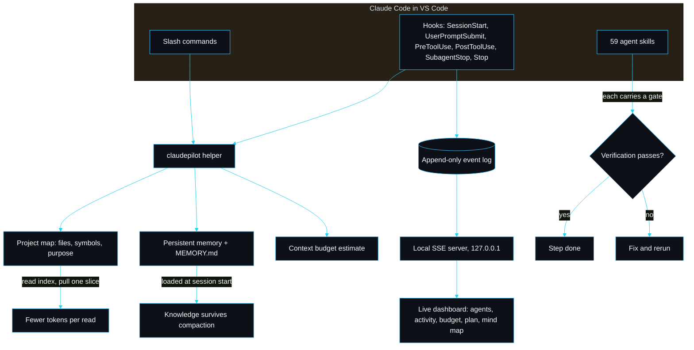

<p align="center"></p>

<h1 align="center">claudepilot by sarmalinux</h1>

<p align="center">Turn Claude Code into a disciplined, token-efficient builder with persistent memory and a live local agent dashboard.</p>

<p align="center">
<a href="./LICENSE"></a>
<a href="https://github.com/sarmakska/claudepilot"></a>
<a href="https://github.com/sarmakska/claudepilot/commits/main"></a>
</p>

A long Claude Code session usually dies one of two ways. Either it reads whole files until the context window is full and starts forgetting the start of its own plan, or it does good work and then the session ends and every decision it made evaporates. claudepilot is a Claude Code plugin I built to stop both, and to let me actually see what the agent is doing while it does it.

You install it into Claude Code in VS Code. It is not a CLI you run as a product; there is a small helper binary the plugin shells out to from its hooks and slash commands, but you never invoke it directly.

## Why I built this

I ship small production sites on Cloudflare, Supabase, Vercel and Resend, and I lean on Claude Code to do the boring parts. The pattern that kept biting me was the long session. Claude would open a 1,200 line component to change one prop, the budget would bleed, and three prompts later it had paged out the convention we agreed on at the top. When I compacted, the durable facts went with the noise. I tried writing everything into CLAUDE.md by hand and it rotted within a day.

So I wrote claudepilot around two habits I wanted enforced rather than remembered: read a compact map and pull a slice instead of reading whole files, and write durable facts to a structured store that survives a compaction. Then I added the thing I actually wanted most, which was a window into the session. When you fire off a plan and a subagent and walk away, you should be able to glance at a tab and see which agent is on which step and how much budget is left. That is pillar five, the live dashboard, and it is the headline feature.

## Watch the agents work

The headline feature. When a session starts, claudepilot's `SessionStart` hook boots a small local server, binds `127.0.0.1` on a free port, and prints the URL into the chat:

```
Live agent dashboard: http://127.0.0.1:53267 (just started)
It streams this session locally; nothing leaves the machine.
```

Open it and you get four live panels, themed in the SarmaLinux palette:

- **Agents.** Every agent and subagent, its status (running, waiting, done, failed), and the task it is on.
- **Discussion / activity.** The per-agent stream of prompts, tool calls and results as they land, grouped so a subagent's work does not tangle with the main thread.
- **Token budget.** A bar that fills as reads pull bytes into context, so you can see headroom before compaction bites.
- **Plan and mind map.** The current plan and a Mermaid map of the session's agents, redrawn as events arrive.

How it is wired, end to end: each lifecycle hook (`SessionStart`, `UserPromptSubmit`, `PreToolUse`, `PostToolUse`, `SubagentStop`, `Stop`) appends one JSON event to an append-only log under `.claude/claudepilot/dashboard/<session>.jsonl`. The server tails that log and pushes folded state to the browser over server-sent events. Because the log is the source of truth, the dashboard can also **replay** a finished session, not just watch a live one. The session picker in the header switches between recorded sessions.

It is honest about what it is: a local observability dashboard for your session. It watches and visualises the agents, it does not drive them. Nothing leaves the machine, there is no telemetry, the bind is local only, and obvious secrets are redacted before they ever reach the log. Auto-open is on by default and lives behind a setting:

```jsonc
// .claude/claudepilot/dashboard.json
{ "enabled": true, "autoOpen": false }
```

Or per session: `CLAUDEPILOT_DASHBOARD=0` disables it, `CLAUDEPILOT_DASHBOARD_OPEN=0` keeps the browser shut. Starting is idempotent, so a resume or a reload reuses the running server rather than spawning a second.

### Before and after: a token budget

The distinctive thing claudepilot changes is the shape of a read. Here is the same task, "rename a prop in a 42 KiB component", measured two ways. The token figures use claudepilot's own conservative 3.6 bytes-per-token estimate (`src/context/budget.ts`).

| Step | Without claudepilot | With claudepilot |
|---|---|---|
| Locate the prop | Read the whole file, 42,000 bytes | Read the project map slice for the file |
| Bytes pulled into context | 42,000 | map entry + one symbol, about 1,800 |
| Approximate tokens | ~11,667 | ~500 |
| Budget bar after the read | one read eats ~6% of a 200k window | barely moves |

The dashboard's token-budget bar makes this visible while it happens: with the read discipline on, the bar crawls; with whole-file reads, it lurches. Those `~11,667` and `~500` figures are exactly what the dashboard shows, computed by the same code that drives the budget panel.

## Install in VS Code and go

You need Claude Code running in VS Code and Node 20 or newer on your PATH (the hooks and helper run on Node).

```
/plugin marketplace add sarmakska/claudepilot
/plugin install claudepilot
```

Open your project. At session start the dashboard boots, the memory index loads, and Claude is nudged to read the map before whole files. Build the map once so reads stay scoped:

```
/claudepilot:map
```

Then work as normal. Save durable decisions with `/claudepilot:remember`, recall them with `/claudepilot:recall`, and check the plan, budget and mind map with `/claudepilot:status`.

## Architecture



## The five pillars

1. **Token efficiency.** A compact, regenerable map of files, exported symbols and purpose (`src/map`). Claude reads the map and one slice, not whole files. The `PreToolUse` hook warns before a large whole-file read; `UserPromptSubmit` reminds it to use the map and recall memory. A budget estimate (`src/context/budget.ts`) tracks approximate usage and says when to compact.
2. **Persistent memory.** A file-based store under `.claude/claudepilot/memory/`: one fact per file with frontmatter, plus a regenerated `MEMORY.md` index (`src/memory`). `SessionStart` loads the index so context survives across sessions; `Stop` nudges Claude to write durable facts. Recall ranks by the `description`, so only the winning bodies get opened.
3. **Guardrailed skill library.** 59 skills across frontend, backend, Supabase, Cloudflare, Vercel, Resend, auth, payments, SEO, analytics, git/release, plus memory and context discipline. Each is a real agent skill with a `SKILL.md`; each shipping skill carries a verification gate, a check the agent runs to prove the step worked. `claudepilot plugin-validate` fails loudly on anything malformed.
4. **Mind map and status in the chat.** `/claudepilot:mindmap` renders the project as a themed Mermaid diagram in chat or a self-contained HTML artifact (`src/dashboard/artifact.ts`). `/claudepilot:status` shows the plan, the budget with a recommendation, the memory count and the map.
5. **Live agent dashboard.** The auto-launching local observability dashboard described above (`src/dashboard`). Hooks to event log to local server to live UI, with replay.

## Design decisions

A few choices I made deliberately, and the alternatives I turned down.

**Server-sent events, not a websocket.** The dashboard traffic is one-directional, server to browser. SSE is a handful of lines over plain HTTP and the browser reconnects on its own. A websocket would buy me a duplex channel I do not need and a dependency that could break the plugin build. The browser never has to tell the server anything except which session to watch, and that fits in a query string.

**node:http, not Express.** The server serves one page, two JSON routes and an event stream. Pulling in Express (and its tree) to do that is weight I would have to keep secure and in sync with the rest of the plugin. The standard library does it in one file (`src/dashboard/server.ts`). The cost is that I write the tiny router by hand, which is a price worth paying for zero runtime dependencies on the server path.

**An append-only JSONL log, not a database.** I considered SQLite for the event store. It would give me indexes and queries I do not need, and a native module that complicates packaging a plugin meant to install cleanly everywhere. A line-per-event JSONL file is append-only by construction, trivially tailable, human-readable when something goes wrong, and it makes replay free: state is a pure fold over the log. The trade-off is that I do my own concurrency control with a small advisory lock so two racing hook processes never pick the same sequence number; that is in `src/dashboard/log.ts` and it is tested under 25 parallel writers.

**A byte-count budget estimate, not a real token meter.** claudepilot cannot read Claude Code's internal token counter, so it estimates from bytes pulled into context at a cautious 3.6 bytes per token. This is guidance, not a guarantee, and the wording everywhere says so. I would rather be honestly approximate and conservative (compact a little early) than precise-looking and wrong.

## Limitations and non-goals

- The token budget is an **estimate**, not the real counter. It is tuned to warn early. Treat the percentages as a strong hint, not gospel.
- The dashboard **observes**; it does not control the agents. It cannot pause a tool call or steer a subagent. That is by design.
- Subagent visibility depends on what Claude Code exposes. There is a reliable `SubagentStop`, so the dashboard infers a subagent from the first event that names it and flips its status on stop. If a future Claude Code adds a real `SubagentStart`, I will wire it.
- The skill library targets the stack I actually ship on (Cloudflare, Supabase, Vercel, Resend). It is **not** trying to be a universal scaffolder for every framework.
- Secret redaction is blunt and pattern-based. It will mask things that are not secrets before it lets a real one through, which is the safe direction, but do not treat it as a vault.

## Roadmap

What I intend to add: a compaction timeline on the dashboard so you can see where the session was offloaded and replayed; an optional per-agent diff view; export of a session log as a shareable HTML artifact (same shape as the mind map artifact). What I will not add: a hosted/cloud version (this stays local-only on purpose), accounts, or any telemetry. If it phones home, it is not claudepilot.

## Development

This repository is both the published plugin and the helper it calls.

```
pnpm install --frozen-lockfile
pnpm build
pnpm lint
pnpm test
pnpm validate
pnpm plugin-validate
```

The suite is 57 tests; on an Apple M3 Pro (Node 25) `pnpm test` runs them in about 0.8s. The dashboard tests cover event validity, the concurrency-safe append-only writer (25 parallel writers, unique sequences), a real server that streams an event end to end on a free port, idempotent start, and replay reconstructing agent state.

The wiki has the full write-up: [Home](https://github.com/sarmakska/claudepilot/wiki) . [Architecture](https://github.com/sarmakska/claudepilot/wiki/Architecture) . [Live-Agent-Dashboard](https://github.com/sarmakska/claudepilot/wiki/Live-Agent-Dashboard) . [Install-in-VS-Code](https://github.com/sarmakska/claudepilot/wiki/Install-in-VS-Code) . [Token-Efficiency](https://github.com/sarmakska/claudepilot/wiki/Token-Efficiency) . [Memory-System](https://github.com/sarmakska/claudepilot/wiki/Memory-System) . [Skill-Engine](https://github.com/sarmakska/claudepilot/wiki/Skill-Engine) . [Skill-Catalogue](https://github.com/sarmakska/claudepilot/wiki/Skill-Catalogue) . [Writing-a-Skill](https://github.com/sarmakska/claudepilot/wiki/Writing-a-Skill) . [Hooks](https://github.com/sarmakska/claudepilot/wiki/Hooks) . [Mind-Map-and-Status](https://github.com/sarmakska/claudepilot/wiki/Mind-Map-and-Status) . [Integrations](https://github.com/sarmakska/claudepilot/wiki/Integrations) . [Troubleshooting](https://github.com/sarmakska/claudepilot/wiki/Troubleshooting) . [Roadmap-and-Limitations](https://github.com/sarmakska/claudepilot/wiki/Roadmap-and-Limitations)

---
Built by Sarma. Part of the SarmaLinux open-source line.
Website: https://sarmalinux.com . GitHub: https://github.com/sarmakska
