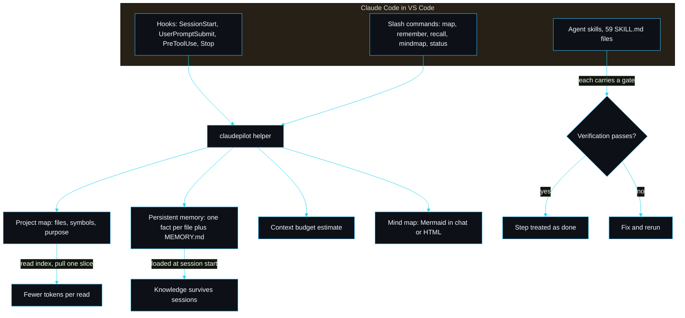

<p align="center"></p>

<h1 align="center">claudepilot by sarmalinux</h1>

<p align="center">Persistent memory and token-efficient retrieval for Claude Code, plus a guardrailed skill library for shipping production sites.</p>

<p align="center">
<a href="./LICENSE"></a>
<a href="https://github.com/sarmakska/claudepilot"></a>
<a href="https://github.com/sarmakska/claudepilot/commits/main"></a>
</p>

claudepilot is a Claude Code plugin. You install it into Claude Code in VS Code and it makes Claude work for hours without running out of context or wasting tokens, by giving Claude a persistent memory and a disciplined, token-efficient way to read your codebase, plus a curated library of guardrailed skills for shipping production sites on Cloudflare, Supabase, Vercel and Resend.

It is not a CLI tool. There is a small helper binary the plugin calls from its hooks and slash commands, but you never run that as the product. You install the plugin and work in Claude Code as usual.

## Why it exists

Two things make a long Claude Code session fall apart. It reads whole files until the context window is full, and it forgets everything it learned the moment the session ends or compacts. claudepilot is built to fix both. It keeps a compact map of your project so Claude reads the index and one slice instead of entire files, and it keeps a structured, file-based memory so durable facts survive across sessions. Every shipping skill carries a verification gate, so a step is only treated as done once a real check (typecheck, build, smoke test or deploy healthcheck) proves it.

This is designed so you rarely hit context limits and stop wasting tokens. It is honest guidance backed by hooks and a budget estimate, not a literal guarantee.

## Install in VS Code and go

You need Claude Code running in VS Code, and Node 20 or newer on your PATH (the plugin's hooks and helper run on Node).

1. Open Claude Code in VS Code and add the marketplace:
   ```
   /plugin marketplace add sarmakska/claudepilot
   ```
2. Install the plugin:
   ```
   /plugin install claudepilot
   ```
3. Open your project. At session start, claudepilot loads your project memory index and nudges Claude to read the map before whole files.
4. Build the project map so reads stay scoped:
   ```
   /claudepilot:map
   ```
5. Work as normal. Save durable decisions with `/claudepilot:remember`, recall them with `/claudepilot:recall`, and check progress with `/claudepilot:status`.

## Architecture



## The four pillars

### 1. Token efficiency, so you rarely hit context limits

- A compact, regenerable project map of files, exported symbols and purpose (`src/map`). Claude reads the map and one relevant slice instead of whole files.
- Scoped retrieval helpers: pull a single symbol (`claudepilot slice`) or a line range (`claudepilot lines`), never the whole file.
- A read-the-map discipline enforced by hooks. The `PreToolUse` hook on `Read` warns before a large whole-file read and points at scoped retrieval; `UserPromptSubmit` reminds Claude to use the map and recall memory.
- A context budget estimate (`src/context/budget.ts`) that tracks approximate usage and tells you when to compact, with a skill that summarises and offloads to memory.

### 2. Persistent memory

- A structured, file-based store under your project at `.claude/claudepilot/memory/`: one fact per file with frontmatter (`name`, `description`, `type`, `tags`) plus a regenerated `MEMORY.md` index (`src/memory`).
- The `SessionStart` hook auto-loads the memory index so context survives across sessions without re-reading the codebase. The `Stop` hook prompts Claude to write durable facts after meaningful work.
- Skills and commands to add, recall, update and prune memories. Recall ranks by the relevance `description`, so Claude reads the index logic and only opens the bodies that win.

### 3. Guardrailed skill library and integrations

- 59 skills across frontend, backend, Supabase, Cloudflare, Vercel, Resend, auth, payments, SEO, analytics, git/release, plus memory and context discipline.
- Each is a real Claude Code agent skill: a `SKILL.md` with valid `name` and `description` frontmatter and a body. Each shipping skill also carries a verification gate under a namespaced `claudepilot` block, a check the agent runs to prove the step worked.
- A validator (`claudepilot plugin-validate`, run in tests and CI) checks the manifest, the marketplace file, every `SKILL.md` and the hooks wiring, failing on anything malformed. See [CONTRIBUTING](./CONTRIBUTING.md) to scale to hundreds.

### 4. Live mind map and status, in the chat

- `/claudepilot:mindmap` renders the project structure as a themed Mermaid diagram directly in the Claude Code chat, and can write a self-contained HTML artifact (`src/dashboard/artifact.ts`).
- `/claudepilot:status` shows the plan, the approximate context budget with a recommendation, the memory count, and the mind map, so you decide whether to keep going or compact.

## Skill catalogue

| Category | Count | Examples |
|---|---|---|
| frontend | 7 | vite-react, tailwind, router, forms, dark-mode |
| supabase | 7 | init, schema, rls, auth, storage, typegen, edge-function |
| cloudflare | 6 | worker, pages, d1, kv, r2, secrets |
| backend | 5 | hono-api, zod-validation, error-handling, rate-limit, openapi |
| git | 5 | init-repo, conventional-commit, feature-branch, pull-request, release-tag |
| auth | 4 | session, oauth, rbac, password-reset |
| payments | 4 | stripe-setup, checkout, subscriptions, webhooks |
| resend | 4 | setup, domain, transactional, webhook |
| seo | 4 | meta-tags, open-graph, sitemap, structured-data |
| vercel | 4 | link, env, preview, deploy |
| analytics | 3 | plausible, events, web-vitals |
| memory | 3 | memory-capture, memory-recall, memory-prune |
| context | 3 | scoped-read, context-budget, compact-and-offload |

Run `npx claudepilot validate` to list them with per-category counts.

## Commands and hooks

Slash commands: `/claudepilot:map`, `/claudepilot:remember`, `/claudepilot:recall`, `/claudepilot:forget`, `/claudepilot:mindmap`, `/claudepilot:status`, `/claudepilot:validate`.

Hooks (in `hooks/hooks.json`): `SessionStart` loads memory and nudges the map; `UserPromptSubmit` reminds Claude to recall and use scoped reads; `PreToolUse` warns on large whole-file reads; `Stop` prompts Claude to persist durable facts.

## How it actually works

When a session starts, the `SessionStart` hook reads `.claude/claudepilot/memory/MEMORY.md` and injects it as context, so Claude knows the project's durable facts before it touches a file. As Claude works, the map keeps reads scoped and the `PreToolUse` hook flags any large whole-file read. When the budget gets tight, the `compact-and-offload` skill summarises the session and writes durable facts to memory, then you compact; after compaction the memory index reloads, so nothing important is lost. Every shipping skill ends in a verification gate, so the work is proven, not assumed.

## Development

This repository is both the published Claude Code plugin and the helper it calls. To work on it:

```
pnpm install
pnpm build
pnpm test
pnpm lint
pnpm plugin-validate
```

The wiki has the full write-up: [Home](https://github.com/sarmakska/claudepilot/wiki), [Architecture](https://github.com/sarmakska/claudepilot/wiki/Architecture), [Install-in-VS-Code](https://github.com/sarmakska/claudepilot/wiki/Install-in-VS-Code), [Token-Efficiency](https://github.com/sarmakska/claudepilot/wiki/Token-Efficiency), [Memory-System](https://github.com/sarmakska/claudepilot/wiki/Memory-System), [Skill-Engine](https://github.com/sarmakska/claudepilot/wiki/Skill-Engine), [Skill-Catalogue](https://github.com/sarmakska/claudepilot/wiki/Skill-Catalogue), [Writing-a-Skill](https://github.com/sarmakska/claudepilot/wiki/Writing-a-Skill), [Hooks](https://github.com/sarmakska/claudepilot/wiki/Hooks), [Mind-Map-and-Status](https://github.com/sarmakska/claudepilot/wiki/Mind-Map-and-Status), [Integrations](https://github.com/sarmakska/claudepilot/wiki/Integrations), [Troubleshooting](https://github.com/sarmakska/claudepilot/wiki/Troubleshooting).

---
Built by Sarma. Part of the SarmaLinux open-source line.
Website: https://sarmalinux.com . GitHub: https://github.com/sarmakska
