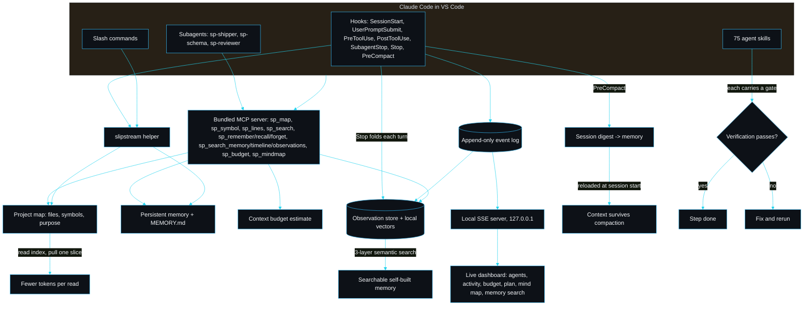

<h1 align="center">slipstream by sarmalinux</h1>

<p align="center">A Claude Code plugin that keeps Claude fast, within budget and never losing the thread.</p>

<p align="center"><em>slipstream is not affiliated with or endorsed by Anthropic. Claude and Claude Code are trademarks of Anthropic, referenced here only to describe compatibility.</em></p>

<p align="center">
<a href="https://github.com/sarmakska/slipstream/actions/workflows/ci.yml"></a>
<a href="https://github.com/sarmakska/slipstream/releases"></a>


<a href="./LICENSE"></a>
<a href="https://github.com/sarmakska/slipstream"></a>
<a href="https://github.com/sarmakska/slipstream/commits/main"></a>
</p>

A long Claude Code session usually dies one of two ways. Either it reads whole files until the context window is full and starts forgetting the start of its own plan, or it does good work and then the session ends and every decision it made evaporates. slipstream is a Claude Code plugin I built to stop both, and to let me actually see what the agent is doing while it does it.

You install it into Claude Code in VS Code. It is not a CLI you run as a product; there is a small helper binary the plugin shells out to from its hooks, its slash commands and a bundled MCP server, but you never invoke it directly. Since v0.6 the same MCP server also works in **Cursor, Windsurf, Antigravity, plain VS Code via MCP and JetBrains via MCP**, with the same fourteen `sp_*` tools, the same dashboard and a one-line idempotent install through `slipstream-setup`.

## What's new in v0.27

- **Production React dashboard** (v0.27.0): the dashboard is now a Vite + React single-page app with a left sidebar and nine routed side-pages, a design system and an interactive click-through knowledge graph, served by the same local server over the existing API. React and Vite are devDependencies bundled to static assets, so the runtime dependency story is unchanged. The previous page stays at ?legacy=1.

## What's new in v0.26

- **Interactive graph** (v0.26.0): click any node in the knowledge graph to read what connects to it, a file shows the sessions that touched it, a session shows the files it changed.

## What's new in v0.25

- **Project knowledge brief** (v0.25.0): `slipstream brief` (or a download on the Overview) dumps the whole project into one Markdown document, what it is, how it is organised, what was built, the memory, lessons, instincts and recent work, so anyone starting later picks it up cold.

## What's new in v0.24

- **Reproducible benchmark** (v0.24.0): `pnpm benchmark` measures whole-file versus scoped symbol reads on real files and prints a Markdown table, so the token-savings claim is a number you can regenerate, not marketing. On this repo a typical scoped read is around 95% smaller than the whole file (per-read, not end-to-end).

## What's new in v0.23

- **Knowledge graph** (v0.23.0): a new Graph tab draws files and the sessions that touched them as a bubble map, larger nodes touched more, edges connecting sessions to the files they changed. Navigate memory by relationship.

## What's new in v0.22

- **`slipstream memory doctor`** (v0.22.0): a terminal health check for the memory store, total, duplicates, stale and by-type, exiting non-zero when it needs attention.

## What's new in v0.21

- **Dollar savings and session reports** (v0.21.0): the dashboard now shows the money saved by scoped reads (rate stated), and any session can be exported as a shareable Markdown report from the Flow tab.

## What's new in v0.20

- **A dashboard that says something** (v0.20.0): the Overview now opens with a real sentence built from the code map and activity, not a jargon blurb, and a bug that printed prompt text as filenames is fixed. Cleaner, more premium panels and headings throughout.

## What's new in v0.19

- **Memory health** (v0.19.0): a health line on the Memory tab reports duplicates, stale entries and the store's shape, so memory stays small, current and trusted instead of becoming a dump.

## What's new in v0.18

- **Instincts** (v0.18.0): slipstream notices what recurs across sessions, hot files and topics that keep coming up, and promotes them to confidence-scored insights on the Memory tab. The project gets sharper with every run.

## What's new in v0.17

- **Conversation search** (v0.17.0): the Memory tab now searches the full recorded chat, not just observations, so "when did we talk about X" returns the exact exchange.

## What's new in v0.16

- **Agents at work** (v0.16.0): the Live tab shows each agent as a small animated character whose mood follows its real activity, typing, reading, running a command, thinking or waiting. Liveness you can watch, drawn in CSS with no external assets.

## What's new in v0.15

- **Message the agent from the dashboard** (v0.15.0): leave a note on the Live tab and the agent receives it as context on its next turn, delivered once. Honest about its limit: it cannot interrupt a turn already running.

## What's new in v0.14

- **Premium web-design skills** (v0.14.0): a frontend track that helps Claude build sites that look designed, not defaulted, a cohesive design system, a high-impact hero, tasteful scroll-reveal motion and the polished marketing sections below it.

## What's new in v0.13

- **Where Claude struggled** (v0.13.0): a live failures panel on the Live tab surfaces errors, denials and failed commands as they happen, next to what Claude is doing and the token budget. The Live tab is now a real agent-health view.

## What's new in v0.12

- **Self-building memory** (v0.12.0): every session is distilled automatically into a durable summary at turn end, built from the real conversation, so memory accrues from what happened rather than from the agent remembering to write it down.
- **Session resume** (v0.12.0): a resume brief reconstructs the open thread and files in flight. Claude gets it injected at session start; you see the same Resume card on the Overview. No session starts cold.

## What's new in v0.11

- **Deliberate-engineering skill suite** (v0.11.0): eight new context skills that make slipstream guide the agent through a real workflow, `using-slipstream`, `test-driven-development`, `verification-before-completion`, code review both ways, `subagent-driven-development`, `finishing-a-branch` and `writing-skills`. The library is now 71 skills.

## What's new in v0.10

- **Full conversation capture** (v0.10.0): slipstream records the whole Claude Code conversation, every ask and the work it produced, folded into per-session exchanges with summaries, persisted locally and gitignored. Read it back on the new Conversation tab and in the Overview.
- **Cleaner reading surfaces** (v0.10.0): the dashboard prose now renders in a clean sans-serif while labels, numbers and code stay monospace.

## What's new in v0.9

- **Overview landing** (v0.9.0): the dashboard opens on a plain-English answer to what the project is, how it is organised (a human-readable architecture summary from the live code map, each area labelled with its role), what has been built and the most recent work.
- **Flow tab** (v0.9.0): the said-to-did map. Each lane is something you said and what the agent did about it, read top to bottom as the story of the session.
- **Memory that survives** (v0.9.0): the Memory tab leads with the context the next session reloads after a lost or compacted session, the digests, durable facts and distilled lessons, readable by you and by Claude Code.
- **Auto-open every session** (v0.9.0): a new session always brings the dashboard to the front. Disable with `SLIPSTREAM_DASHBOARD_OPEN=0`.

## What's new in v0.8

- **Dashboard insights band** (v0.8.0): every data tab opens with a natural-language band, one paragraph plus three to five bullets, that describes the view rather than only tabulating it. Live names the session, tool count, optimisation percentage and files in focus and flags the budget level. Project names the dominant focus area, drift flags and the memory accumulation rate. Journal summarises one day. Sessions ranks the unusually heavy and quiet ones. Generated deterministically from the existing observation store, so there is no LLM, no new persistence, and every sentence traces to one source query.

## What's new in v0.7

- **Tabbed live dashboard** (v0.7.0): five views on one local URL. **Live** keeps the v0.6 KPI strip and timeline. **Project** adds a 365-day GitHub-style activity heatmap, a file leaderboard, an inline-SVG kinds donut and a distilled lessons grid. **Journal** gives a per-day digest with prev/today/next nav, clickable straight from the heatmap. **Sessions** lists every recorded session with open and delete actions, gated behind a confirmation modal. **Memory** wraps the full-project observation search with kind filter chips.
- **Windows hook telemetry** (v0.7.1): `emit()` writes in-process and every hook awaits it. The detached-spawn-then-exit pattern silently lost every event on Windows; observation memory now builds.
- **MCP-only memory populates** (v0.7.2): `foldObservations` gains an opt-in `flushOpen`. The four memory-reading `sp_` tools call it in MCP-only mode so Cursor, Windsurf and Antigravity see a populated memory the moment they query it. Claude Code mode is unchanged.
- **Doctor cross-IDE checks** (v0.6.1 + v0.7.2): `duplicate-registration`, `double-emit` and `stale-dashboard` catch the exact setup problems that bit early MCP-only users. Each FAIL line carries a one-line fix.
- **Dashboard `/api/health`** (v0.6.1): version, pid, startedAt. `sp_dashboard` probes it on every start and restarts a stale dashboard from a previous build instead of reusing it.

## What you feel on day one

Five things change the moment slipstream is installed and a project is open.

1. **Claude works through precise tools, not whole-file reads.** A bundled MCP server (`src/mcp`) exposes `sp_map`, `sp_symbol`, `sp_lines` and `sp_search`. Claude orients with the map and pulls one symbol or one line range, so a single `sp_symbol` call replaces opening the whole file. The worked numbers are below.
2. **Memory builds itself, and you can search it.** Every turn of work is folded into a compact observation (summary, files touched, tags, a stable id, a local semantic vector) without anyone calling `remember`. You query it back through a three-layer search — `sp_search_memory` for a cheap ranked index, `sp_timeline` for context, `sp_observations` for full detail — so "what did we do about the auth bug three weeks ago" is answerable.
3. **Context survives compaction.** A `PreCompact` hook (`hooks/pre-compact.mjs`) writes a structured digest of the session (open task, decisions, files touched, next steps) to the memory store the instant before Claude Code compacts. The next session reloads that digest, so the thread is not lost when the window is trimmed.
4. **You watch the agents in a local dashboard.** Session start boots a `127.0.0.1` server and prints the URL into the chat. You glance at a tab and see which agent is on which step, and a Memory search panel queries your project's observations.
5. **You see the budget — and the savings — in the statusline.** The status bar shows `cp | ctx 12% ok | mem 4 | obs 37 | opt 71% | skill scoped-read`. Inside Claude Code the `ctx` percentage is the **real** context-window occupancy read from the session transcript (shown as `ctx 12%*`, the `*` marking it exact rather than estimated); elsewhere it is a conservative estimate. `opt 71%` is how much slipstream's scoped reads trimmed versus whole-file reads — an exact figure in **any** editor.

## Why I built this

I ship small production sites on Cloudflare, Supabase, Vercel and Resend, and I lean on Claude Code to do the boring parts. The pattern that kept biting me was the long session. Claude would open a 1,200 line component to change one prop, the budget would bleed, and three prompts later it had paged out the convention we agreed on at the top. When I compacted, the durable facts went with the noise. I tried writing everything into CLAUDE.md by hand and it rotted within a day.

So I wrote slipstream around two habits I wanted enforced rather than remembered: read a compact map and pull a slice instead of reading whole files, and write durable facts to a structured store that survives a compaction. Then I added the thing I actually wanted most, which was a window into the session. When you fire off a plan and a subagent and walk away, you should be able to glance at a tab and see which agent is on which step and how much budget is left. That is pillar five, the live dashboard, and it is the headline feature.

## Watch the agents work

The headline feature. When a session starts, slipstream's `SessionStart` hook boots a small local server, binds `127.0.0.1` on a free port, and prints the URL into the chat:

```
Live agent dashboard: http://127.0.0.1:53267 (just started)
It streams this session locally; nothing leaves the machine.
```

Open it and you get four live panels, themed in the SarmaLinux palette:

- **Agents.** Every agent and subagent, its status (running, waiting, done, failed), and the task it is on.
- **Discussion / activity.** The per-agent stream of prompts, tool calls and results as they land, grouped so a subagent's work does not tangle with the main thread.
- **Token budget.** A bar that fills as reads pull bytes into context, so you can see headroom before compaction bites.
- **Plan and mind map.** The current plan and a Mermaid map of the session's agents, redrawn as events arrive.

How it is wired, end to end: each lifecycle hook (`SessionStart`, `UserPromptSubmit`, `PreToolUse`, `PostToolUse`, `SubagentStop`, `Stop`) appends one JSON event to an append-only log under `.claude/slipstream/dashboard/<session>.jsonl`. The server tails that log and pushes folded state to the browser over server-sent events. Because the log is the source of truth, the dashboard can also **replay** a finished session, not just watch a live one. The session picker in the header switches between recorded sessions.

It is honest about what it is: a local observability dashboard for your session. It watches and visualises the agents, it does not drive them. Nothing leaves the machine, there is no telemetry, the bind is local only, and obvious secrets are redacted before they ever reach the log. Auto-open is on by default and lives behind a setting:

```jsonc
// .claude/slipstream/dashboard.json
{ "enabled": true, "autoOpen": false }
```

Or per session: `SLIPSTREAM_DASHBOARD=0` disables it, `SLIPSTREAM_DASHBOARD_OPEN=0` keeps the browser shut. Starting is idempotent, so a resume or a reload reuses the running server rather than spawning a second.

## Before and after: a real token example

The distinctive thing slipstream changes is the shape of a read. Here is a real one from this repository: a task that needs the body of `retrieveSymbol` in `src/map/retrieve.ts`. The token figures use slipstream's own conservative 3.6 bytes-per-token estimate (`src/context/budget.ts`), computed by running the helper on this machine (Apple Silicon, Node 25):

```
$ wc -c src/map/retrieve.ts
    4841 src/map/retrieve.ts          # whole file: 4,841 bytes, ~1,345 tokens

$ node dist/cli/index.js slice . src/map/retrieve.ts retrieveSymbol | wc -c
    1381                              # sp_symbol slice: 1,381 bytes, ~384 tokens
```

| Approach | Bytes into context | Approx tokens | Saving |
|---|---|---|---|
| Whole-file `Read` of `retrieve.ts` | 4,841 | ~1,345 | baseline |
| `sp_symbol(retrieve.ts, retrieveSymbol)` | 1,381 | ~384 | **71% fewer** |

That gap widens with file size. Orienting in the whole `src/` tree by reading every file is about 40,597 tokens (146,150 bytes); reading the `sp_map` index instead is about 2,173 tokens (7,821 bytes), **5.4% of reading everything**. The dashboard's token-budget bar makes this visible while it happens: with the tools on, the bar crawls; with whole-file reads, it lurches.

slipstream keeps a running tally of exactly this. Every scoped read folds the bytes it served against the whole-file baseline into a small `.claude/slipstream/savings.json`, so `sp_savings` (and the `opt %` statusline segment, and the dashboard's Session-work panel) can tell you "saved ~N tokens, Y% less than whole-file reads". Because it is computed from slipstream's own calls, that number is exact in **every** editor — Cursor, Windsurf, Antigravity, VS Code — even where the true context count is not readable.

## The MCP tools

The bundled MCP server (declared in `.claude-plugin/plugin.json` under `mcpServers`, served over stdio by `dist/mcp/index.js`) is the biggest single token win. Claude Code loads it automatically. The tools:

| Tool | What it returns |
|---|---|
| `sp_map` | the compact project map (files, exported symbols, purpose). No file contents. |
| `sp_symbol(file, symbol)` | just that symbol's source slice, with its doc comment. |
| `sp_lines(file, start, end)` | exactly that line range. |
| `sp_search(query)` | ranked file locations for a query. Locations, not contents. |
| `sp_remember` / `sp_recall` / `sp_forget` | the hand-authored memory store as tools. |
| `sp_search_memory(query)` | layer 1 of memory search: a compact ranked index of auto-captured observations (id, time, kind, summary). |
| `sp_timeline(around)` | layer 2: chronological context around an observation id or the best match for a query. |
| `sp_observations(ids)` | layer 3: full detail for only the observation ids you filtered down to. |
| `sp_lessons()` | recurring topics distilled from the observation store — what this project keeps making you work on — with citations. |
| `sp_savings()` | how much slipstream optimised: tokens served by scoped reads versus whole-file reads, and the percentage trimmed. Exact in any editor. |
| `sp_budget()` | the context-budget level (ok/warn/compact) against the shared `budget.json` target and thresholds. |
| `sp_mindmap()` | the project as a themed Mermaid mind map. |
| `sp_dashboard()` | ensures the live dashboard is running and returns its URL, in any editor. |

Every tool returns the smallest correct thing; `sp_symbol` never returns the whole file, and the three memory-search tools are layered cheapest-first so recall never dumps full bodies into context to find one record. That discipline lives in `src/mcp/tools.ts` where it cannot be bypassed.

## Memory that builds itself, and semantic search

`sp_remember` is the memory you choose to keep. The other half of the store is memory slipstream keeps for you. After every turn, the `Stop` hook folds that turn out of the dashboard's own event log into a compact **observation** under `.claude/slipstream/observations/<session>.jsonl`: a one-line summary, the files touched, tags, a stable project-wide id, and a local semantic vector. Capture is incremental and idempotent (a per-session cursor means re-running adds nothing) and runs detached, so it never blocks or breaks the session. Nobody has to decide a turn was worth remembering; the trace is there either way.

You search it back through three tools, used cheapest-first so recall never pays for bodies it does not need:

1. `sp_search_memory(query)` returns a compact ranked index — id, time, kind, one-line summary — matched by both meaning and keyword.
2. `sp_timeline(around)` shows the chronological neighbours of an interesting hit, still as one-liners.
3. `sp_observations(ids)` fetches full detail only for the ids you kept.

Ranking is hybrid: a local semantic embedding (`src/memory/embed.ts`, a deterministic hashed term-frequency vector with cosine similarity) blended with exact-term overlap, so a result that literally contains the words is never beaten by one that is merely similar. It is honestly lexical-semantic, not a learned model — the trade that keeps it zero-dependency, with no SQLite, no Python and no vector-database process. Each observation id doubles as a citation handle, browsable while the dashboard runs at `http://127.0.0.1:<port>/api/observation/<id>`, and the dashboard's Memory search panel queries the same store. The full design is in the wiki: [Observation memory and semantic search](https://github.com/sarmakska/slipstream/wiki/Observation-Memory).

Over time, `sp_lessons` distils that history one step further: it clusters the observations by the files and concepts the work centred on and surfaces the topics that **recur** — how often, across how many sessions, with citations — so "what does this project keep making me do" has an answer, and the strongest patterns are candidates to promote into a hand-authored memory.

## Lossless compaction and smart recall

The two memory features that make a long session survivable.

**Lossless compaction.** Claude Code fires `PreCompact` just before it summarises and trims the conversation, which is exactly the moment the thread tends to blur. slipstream's hook reconstructs what happened from the dashboard event log, builds a structured digest (open task, decisions, files touched, next step) in `src/memory/digest.ts`, and writes it to the store as a durable fact. On the next session start it is reloaded first, so a resumed session picks up where it left off rather than from a lossy summary.

**Smart recall, not load-everything.** A naive memory layer dumps the whole store back into context every session, which costs more tokens the larger it grows. slipstream instead builds a task signal from the git branch, the files changed in the working tree and the last prompt, ranks memories against it (`src/memory/recall.ts`), and reloads only the relevant subset under a hard ~1,200 token ceiling, plus the `MEMORY.md` index for the rest. With no signal it loads nothing and defers to the index, because loading arbitrary memories with no signal is the behaviour we are avoiding.

## The statusline and the terse output style

The plugin ships a statusline command (`statusline/slipstream-statusline.mjs`, declared under `statusLine` in the manifest) that renders one line in the Claude Code status bar:

```
cp | ctx 12% ok | mem 4 | skill scoped-read | Opus 4.8
```

Context budget level, durable memory count, active skill, model. The formatting is pure and unit-tested (`src/statusline`). It also ships an output style, `output-styles/slipstream.md`, tuned for terse, high-signal answers; switch to it with `/output-style slipstream` to spend fewer tokens per turn.

## Shipped subagents

Three lean, token-disciplined subagents under `agents/`, each using the MCP tools rather than whole-file reads:

- **sp-shipper.** Takes a site from scaffold to deployed across the integration skills, running each verification gate and refusing to advance past a red one.
- **sp-schema.** Designs and migrates a Supabase/Postgres schema with row level security that denies by default.
- **sp-reviewer.** A pre-push guardrail: lint, build, tests and a secret scan, with a clear FAIL verdict that blocks the push.

Delegate with the Task tool, for example "use sp-reviewer to check this before I push".

## /slipstream:doctor

After install, run `/slipstream:doctor`. It checks the whole install end to end (MCP server built and declared, every hook including `PreCompact` wired, the memory store reachable, the helper CLI built, the statusline, output style and subagents present, the plugin manifest valid) and prints a `PASS`/`FAIL` line per check, so you know it is working.

## Run it in any IDE

slipstream has two layers. The full plugin (skills, hooks, lossless compaction, the statusline and auto-captured memory) runs inside Claude Code. The MCP server — the token-saving tools, the memory search, **and now the live dashboard and token-budget gauge** — is standard Model Context Protocol and runs in any MCP-capable editor, including Antigravity, Cursor and Windsurf. The full cross-IDE story is in the wiki: [Cross-IDE support](https://github.com/sarmakska/slipstream/wiki/Cross-IDE-Support).

### Claude Code: the full experience

This works in the Claude Code CLI, the Claude Code VS Code extension and the JetBrains extension. You need Node 20 or newer on your PATH (the hooks and helper run on Node).

```
/plugin marketplace add sarmakska/slipstream
/plugin install slipstream
```

Open your project, build the map once with `/slipstream:map`, then work as normal. Verify the install with `/slipstream:doctor`, save durable decisions with `/slipstream:remember`, recall them with `/slipstream:recall`, and check the plan, budget and mind map with `/slipstream:status`. At session start the dashboard boots, the memory index loads, and Claude is nudged to read the map before whole files.

### Any MCP-capable IDE: Antigravity, Cursor, Windsurf and others

These editors do not load Claude Code plugins, so the skills, hooks, slash commands and statusline are not available there. The MCP tools are — and as of v0.4.0 the MCP server also feeds and auto-starts the live dashboard itself, so you get the activity view, the token-budget gauge and memory search in a browser tab with no hooks. Build the server once, then register it.

```
git clone https://github.com/sarmakska/slipstream
cd slipstream
pnpm install
pnpm build
```

Register the server in your editor's MCP configuration, using the absolute path to the built entry point:

```json
{
  "mcpServers": {
    "slipstream": {
      "command": "node",
      "args": ["/absolute/path/to/slipstream/dist/mcp/index.js"]
    }
  }
}
```

Where that config lives, by editor:

- Antigravity IDE: open Settings, find the MCP section, and add the block above.
- Cursor: put it in `.cursor/mcp.json` in the project, or add it under Settings, then MCP.
- Windsurf: edit `~/.codeium/windsurf/mcp_config.json`, or add it under Settings, then Cascade MCP.
- Any other MCP client: wherever that client reads an `mcpServers` block.

Once it loads, the agent gains `sp_map`, `sp_symbol`, `sp_lines`, `sp_search`, `sp_remember`, `sp_recall`, `sp_forget`, `sp_search_memory`, `sp_timeline`, `sp_observations`, `sp_lessons`, `sp_budget`, `sp_mindmap` and `sp_dashboard`. Ask it to orient with `sp_map`, to read single declarations with `sp_symbol` rather than whole files (where the token saving comes from), and to call `sp_dashboard` to open the live view — the dashboard fills as it works, the budget gauge climbs, and memory search is in the panel. The memory-search tools work here too, though auto-capture is driven by the `Stop` hook and so fills in fully only under Claude Code; outside it, the MCP server still emits activity for the dashboard, and you can record observations with `slipstream observe`. Skills, hooks and the statusline still need Claude Code, so for those open the same project there.

## Architecture



## The five pillars

1. **Token efficiency.** A compact, regenerable map of files, exported symbols and purpose (`src/map`), exposed through the bundled MCP server (`src/mcp`) as `sp_map`, `sp_symbol`, `sp_lines` and `sp_search`. Claude reads the map and one slice, not whole files. The `PreToolUse` hook warns before a large whole-file read; `UserPromptSubmit` reminds it to use the map and recall memory. A budget estimate (`src/context/budget.ts`) tracks approximate usage and says when to compact.
2. **Persistent memory, with lossless compaction and self-building observations.** A file-based store under `.claude/slipstream/memory/`: one fact per file with frontmatter, plus a regenerated `MEMORY.md` index (`src/memory`). The `PreCompact` hook writes a session digest before compaction; `SessionStart` reloads that digest plus a signal-ranked relevant subset (branch, changed files, last prompt), never the whole store. `Stop` nudges Claude to write durable facts — and also auto-captures the turn as a searchable observation. Alongside the hand-authored store, `.claude/slipstream/observations/` holds a compact, semantically searchable record of every turn, queried through the three-layer `sp_search_memory` / `sp_timeline` / `sp_observations` tools and a local vector embedding (`src/memory/embed.ts`, `observe.ts`, `search.ts`).
3. **Guardrailed skill library.** 75 skills across frontend, backend, Supabase, Cloudflare, Vercel, Resend, auth, payments, SEO, analytics, git/release, plus memory and context discipline. The frontend set includes a premium-design track for sites that look designed rather than defaulted: `frontend-design-system`, `frontend-hero-section`, `frontend-motion` and `frontend-marketing-sections`. The context discipline now includes a full deliberate-engineering workflow suite: `using-slipstream` (recall and read the map first, record what is durable), `test-driven-development`, `verification-before-completion`, `requesting-code-review`, `receiving-code-review`, `subagent-driven-development`, `finishing-a-branch` and `writing-skills`, alongside `think-before-coding`, `systematic-debugging`, `brainstorm-spec` and `write-plan`. Each is a real agent skill with a `SKILL.md`; each shipping skill carries a verification gate, a check the agent runs to prove the step worked. `slipstream plugin-validate` fails loudly on anything malformed.
4. **Mind map and status in the chat.** `/slipstream:mindmap` renders the project as a themed Mermaid diagram in chat or a self-contained HTML artifact (`src/dashboard/artifact.ts`). `/slipstream:status` shows the plan, the budget with a recommendation, the memory count and the map.
5. **Live agent dashboard.** The auto-launching local observability dashboard described above (`src/dashboard`). Hooks to event log to local server to live UI, with replay.

## Design decisions

A few choices I made deliberately, and the alternatives I turned down.

**A hand-rolled MCP server, not the SDK.** I bundle the MCP server (`src/mcp/server.ts`) as a small JSON-RPC-over-stdio loop rather than depending on `@modelcontextprotocol/sdk`. The slice of the protocol Claude Code drives is tiny and stable (initialize, tools/list, tools/call), and a plugin that bundles a server should add as little to a user's install as possible. The cost is that I implement the framing myself; the benefit is zero runtime dependencies on the MCP path and a server I can audit in one file. The request handler is pure and exported, so the tests drive it without a process, and a separate test spawns the real binary over stdio.

**Signal-ranked recall, not load-everything.** The obvious memory design reloads the whole store each session. I rejected it because it gets more expensive the more useful the store becomes. Recall instead ranks against a cheap task signal and reloads only the subset that fits a token budget. With no signal it loads nothing, because loading arbitrary facts with no signal is the very thing I was trying to avoid.

**Server-sent events, not a websocket.** The dashboard traffic is one-directional, server to browser. SSE is a handful of lines over plain HTTP and the browser reconnects on its own. A websocket would buy me a duplex channel I do not need and a dependency that could break the plugin build. The browser never has to tell the server anything except which session to watch, and that fits in a query string.

**node:http, not Express.** The server serves one page, two JSON routes and an event stream. Pulling in Express (and its tree) to do that is weight I would have to keep secure and in sync with the rest of the plugin. The standard library does it in one file (`src/dashboard/server.ts`). The cost is that I write the tiny router by hand, which is a price worth paying for zero runtime dependencies on the server path.

**An append-only JSONL log, not a database.** I considered SQLite for the event store. It would give me indexes and queries I do not need, and a native module that complicates packaging a plugin meant to install cleanly everywhere. A line-per-event JSONL file is append-only by construction, trivially tailable, human-readable when something goes wrong, and it makes replay free: state is a pure fold over the log. The trade-off is that I do my own concurrency control with a small advisory lock so two racing hook processes never pick the same sequence number; that is in `src/dashboard/log.ts` and it is tested under 25 parallel writers.

**A byte-count budget estimate, not a real token meter.** slipstream cannot read Claude Code's internal token counter, so it estimates from bytes pulled into context at a cautious 3.6 bytes per token. This is guidance, not a guarantee, and the wording everywhere says so. I would rather be honestly approximate and conservative (compact a little early) than precise-looking and wrong.

## Limitations and non-goals

- The token budget is an **estimate**, not the real counter. It is tuned to warn early. Treat the percentages as a strong hint, not gospel.
- The dashboard **observes**; it does not control the agents. It cannot pause a tool call or steer a subagent. That is by design.
- Subagent visibility depends on what Claude Code exposes. There is a reliable `SubagentStop`, so the dashboard infers a subagent from the first event that names it and flips its status on stop. If a future Claude Code adds a real `SubagentStart`, I will wire it.
- The skill library targets the stack I actually ship on (Cloudflare, Supabase, Vercel, Resend). It is **not** trying to be a universal scaffolder for every framework.
- Secret redaction is blunt and pattern-based. It will mask things that are not secrets before it lets a real one through, which is the safe direction, but do not treat it as a vault.

## Roadmap

What I intend to add: a compaction timeline on the dashboard so you can see where the session was offloaded and replayed; an optional per-agent diff view; export of a session log as a shareable HTML artifact (same shape as the mind map artifact). What I will not add: a hosted/cloud version (this stays local-only on purpose), accounts, or any telemetry. If it phones home, it is not slipstream.

## Development

This repository is both the published plugin and the helper it calls.

```
pnpm install --frozen-lockfile
pnpm build
pnpm lint
pnpm test
pnpm validate
pnpm plugin-validate
```

The suite is 309 tests across 45 files; `pnpm test` runs them in about 1.6s. Beyond the dashboard tests (event validity, the concurrency-safe append-only writer under 25 parallel writers, a real SSE server end to end, idempotent start, replay), the suite spawns the real MCP server over stdio and asserts `tools/list` and a `sp_symbol` call return correct, minimal output; checks the PreCompact digest builds and reloads; checks signal-ranked recall returns only the relevant subset within budget; exercises the local embedding, the turn-folding observation capture and the three-layer semantic search; pins the statusline string; and runs doctor against both the real tree and a deliberately broken one.

The wiki has the full write-up: [Home](https://github.com/sarmakska/slipstream/wiki) . [Architecture](https://github.com/sarmakska/slipstream/wiki/Architecture) . [MCP-Tools](https://github.com/sarmakska/slipstream/wiki/MCP-Tools) . [Lossless-Compaction](https://github.com/sarmakska/slipstream/wiki/Lossless-Compaction) . [Memory-Recall](https://github.com/sarmakska/slipstream/wiki/Memory-Recall) . [Subagents](https://github.com/sarmakska/slipstream/wiki/Subagents) . [Statusline](https://github.com/sarmakska/slipstream/wiki/Statusline) . [Output-Style](https://github.com/sarmakska/slipstream/wiki/Output-Style) . [Live-Agent-Dashboard](https://github.com/sarmakska/slipstream/wiki/Live-Agent-Dashboard) . [Token-Efficiency](https://github.com/sarmakska/slipstream/wiki/Token-Efficiency) . [Skill-Engine](https://github.com/sarmakska/slipstream/wiki/Skill-Engine) . [Skill-Catalogue](https://github.com/sarmakska/slipstream/wiki/Skill-Catalogue) . [Writing-a-Skill](https://github.com/sarmakska/slipstream/wiki/Writing-a-Skill) . [Hooks](https://github.com/sarmakska/slipstream/wiki/Hooks) . [Install-in-VS-Code](https://github.com/sarmakska/slipstream/wiki/Install-in-VS-Code) . [FAQ](https://github.com/sarmakska/slipstream/wiki/FAQ) . [Troubleshooting](https://github.com/sarmakska/slipstream/wiki/Troubleshooting) . [Roadmap-and-Limitations](https://github.com/sarmakska/slipstream/wiki/Roadmap-and-Limitations)

---
slipstream is not affiliated with or endorsed by Anthropic. Claude and Claude Code are trademarks of Anthropic, referenced here only to describe compatibility.

Built by Sarma. Part of the SarmaLinux open-source line.
Website: https://sarmalinux.com . GitHub: https://github.com/sarmakska
