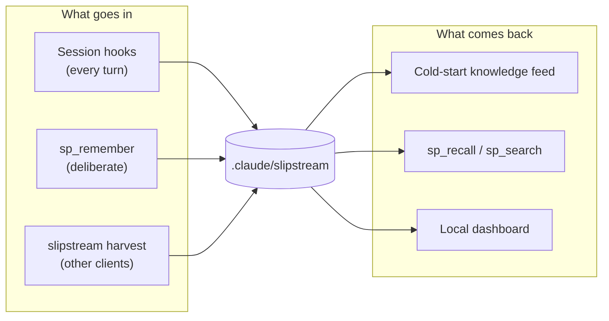

# slipstream docs

Start with the [project README](../README.md) for what slipstream is and how to install it.
These pages go deeper on one thing each.

| Page | What it covers |
|---|---|
| [Cross-client memory](cross-client-memory.md) | How one project store is shared across every AI client — the live MCP route, the `harvest` job, which clients can be read and which cannot |

## The shape of the thing

Everything slipstream knows about a project lives in one gitignored directory inside that
project. Nothing is global, nothing is uploaded, and deleting the directory resets it
completely.

```
.claude/slipstream/
├── memory/                 durable facts, one file each, plus MEMORY.md as the index
├── conversations/          folded chats - one human ask plus the work that followed
├── observations/           per-turn records the session hooks write
├── dashboard/              the append-only event log, one file per session
├── harvest-state.json      size + mtime per harvested transcript
├── map.json / map.md       the scoped code map
└── bus.jsonl               cross-tab coordination
```



## Two rules worth knowing before you change anything

**The agent must never be blocked.** Hooks run on the critical path of a real session. The
advisory write lock is deliberately best-effort: a caller that cannot take it proceeds
anyway. That is why nothing may depend on the lock for correctness — anything needing to be
unique has to be derivable without it. The event log numbers entries by position on read
for exactly this reason.

**Capture is cheap; judgement is not.** Folding a transcript is deterministic and lossless,
so slipstream keeps everything readable and lets recall do the selecting. Deciding at
capture time which conversations mattered would throw away context that cannot be
recovered.

## Working on slipstream

```bash
pnpm test          # the suite
pnpm typecheck     # tsc, no emit
pnpm lint          # eslint
pnpm build         # server + dashboard
pnpm benchmark     # regenerate the token-savings table
```

The suite spawns processes and touches the filesystem, so it is sensitive to a saturated
machine. If files fail with timeouts rather than assertion errors, run
`pnpm vitest run --no-file-parallelism` before concluding anything is broken.
