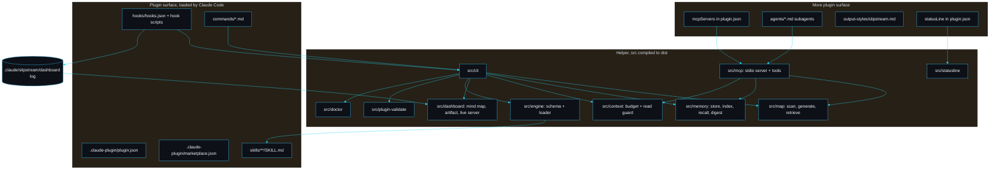

# Architecture

slipstream is one repository that is both the published Claude Code plugin and the small helper the plugin calls. The plugin surface (manifest, skills, commands, hooks) is what Claude Code loads; the helper (compiled TypeScript under `dist/`) is what the hooks and commands invoke for the heavy lifting.

## Modules

- `src/mcp` (`server.ts`, `tools.ts`, `index.ts`). The bundled MCP server. `tools.ts` defines the nine `sp_` tools and `callTool`, each a thin wrapper over the same library the CLI uses; `server.ts` is the pure `handleRequest` dispatcher plus the newline-delimited JSON-RPC stdio loop; `index.ts` is the entry point Claude Code spawns. See [MCP tools](MCP-Tools).
- `src/statusline` (`index.ts`). `formatStatusline` renders the status bar line (budget, memory count, active skill, model) as a pure function. See [Statusline](Statusline).
- `src/doctor` (`index.ts`). `runDoctor` checks the whole install end to end (MCP build and declaration, every hook including PreCompact, memory dir, CLI build, statusline, output style, subagents, plugin validity) and `renderDoctor` prints the pass/fail report. Backs `/slipstream:doctor`.
- `src/engine` (`schema.ts`, `loader.ts`). The skill contract and the loader. `skillFrontmatterSchema` enforces the Claude Code `name` and `description` fields plus a namespaced `slipstream` block (category, requires, verification gate, tags). `loadSkills` walks `skills/**/SKILL.md`, aggregates every issue, checks the directory name matches the skill name, and rejects shipping skills without a gate.
- `src/map` (`scan.ts`, `generate.ts`, `retrieve.ts`, `types.ts`). The project map. `generateMap` reads each source file once, extracts its exported surface and a one-line purpose with a cheap line scan, and never stores file contents. `retrieveSymbol` returns a single declaration by walking braces from its line; `retrieveLines` returns a bounded line range; `searchMap` ranks files by a query.
- `src/memory` (`store.ts`, `types.ts`, `recall.ts`, `digest.ts`). The persistent memory store and the two features built on it. `store.ts` is one Markdown file per fact under `.claude/slipstream/memory/` with a regenerated `MEMORY.md` index (`addMemory`, `pruneMemory`, `listMemories`, `recallMemories`, `regenerateIndex`). `recall.ts` is signal-ranked recall (`rankBySignal`, `selectRelevant`); `digest.ts` builds the PreCompact session digest (`buildDigest`, `digestToMemory`). See [Memory recall](Memory-Recall) and [Lossless compaction](Lossless-Compaction).
- `src/context` (`budget.ts`). The token budget. `estimateTokens` converts bytes to an approximate token count; `budget` reports an `ok`, `warn` or `compact` level against the window; `guardRead` flags large whole-file reads.
- `src/dashboard` (`model.ts`, `artifact.ts`, plus the live dashboard files below). The mind map: `buildMindMap` turns the project map into a tree; `mindMapToMermaid` renders it as a themed Mermaid flowchart for the chat; `renderArtifact` writes a self-contained HTML file.
- `src/dashboard` (live server: `events.ts`, `log.ts`, `state.ts`, `server.ts`, `launch.ts`, `runner.ts`, `settings.ts`, `ui.ts`). The live agent dashboard, pillar five. `events.ts` defines and redacts the event schema; `log.ts` is the concurrency-safe append-only writer and reader; `state.ts` folds events into agent state (the same fold drives live view and replay); `server.ts` is the `node:http` server with SSE; `launch.ts` does idempotent start and browser open; `runner.ts` is the detached process entry point. See [Live agent dashboard](Live-Agent-Dashboard) for the full walkthrough.
- `src/plugin-validate` (`index.ts`). The validator that proves the plugin is well formed.
- `src/cli` (`index.ts`, `skills-dir.ts`). The helper entry point. It dispatches `map`, `slice`, `lines`, `guard`, `budget`, `memory`, `mindmap`, `status`, `dashboard`, `validate`, `plugin-validate`, `doctor`, `statusline`, `recall-signal` and `digest`.

## Data that lives in your project

slipstream writes only under `.claude/slipstream/` in your project: `map.md` and `map.json`; `memory/` with one file per fact plus `MEMORY.md`; `dashboard/` with one append-only `<session>.jsonl` event log per session and a `server.json` recording the running server; and an optional `dashboard.json` for settings. This directory is git-ignored by default in this repo and is meant to be local to each developer unless you choose to commit the memory.

## Design choices, and what I rejected

- **The map favours a fast heuristic line scan over a full parser.** The agent uses the map to decide where to look and then reads the real slice, so a perfect AST would be cost without payoff. I rejected wiring in the TypeScript compiler API for the map: it would couple the map to one language and pay a parse tax on every regeneration for accuracy the agent does not need.
- **Memory is files, not a database.** Reviewable, diffable, and it survives without a running service. The index is regenerated from the files so it can never silently drift. I rejected SQLite here for the same reason I rejected it for the event log: a native module complicates packaging a plugin meant to install cleanly everywhere.
- **The event log is append-only JSONL, not a database.** Append-only by construction, tailable, human-readable, and replay is a pure fold over the lines. The trade-off is hand-rolled concurrency control (a small advisory lock in `log.ts`) so two racing hook processes never collide on a sequence number; that path is tested under 25 parallel writers.
- **The dashboard streams over server-sent events on `node:http`, not a websocket on a framework.** The traffic is one-directional and SSE reconnects on its own; a websocket and Express would add weight and a dependency that could break the plugin build. The cost is a tiny hand-written router.
- **The MCP server is hand-rolled, not the SDK.** The slice of the protocol Claude Code drives is small and stable, and a plugin that bundles a server should add as little as possible to a user's install. I rejected depending on `@modelcontextprotocol/sdk`: it would pull a dependency tree onto the MCP path for framing I can write in one file. The handler is pure and exported, so tests drive it without a process. See [Design decisions](Design-Decisions).
- **The helper owns only the objective parts** (indexing, retrieval, budget, validation, event recording, the MCP transport). The judgement (what to remember, when to compact, whether a gate is the right one) stays with the agent following the skills.

---
SarmaLinux . sarmalinux.com . [Repository](https://github.com/sarmakska/slipstream)
