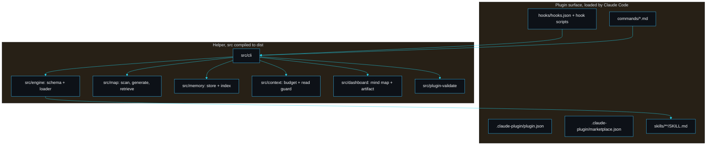

# Architecture

claudepilot is one repository that is both the published Claude Code plugin and the small helper the plugin calls. The plugin surface (manifest, skills, commands, hooks) is what Claude Code loads; the helper (compiled TypeScript under `dist/`) is what the hooks and commands invoke for the heavy lifting.

## Modules

- `src/engine` (`schema.ts`, `loader.ts`). The skill contract and the loader. `skillFrontmatterSchema` enforces the Claude Code `name` and `description` fields plus a namespaced `claudepilot` block (category, requires, verification gate, tags). `loadSkills` walks `skills/**/SKILL.md`, aggregates every issue, checks the directory name matches the skill name, and rejects shipping skills without a gate.
- `src/map` (`scan.ts`, `generate.ts`, `retrieve.ts`, `types.ts`). The project map. `generateMap` reads each source file once, extracts its exported surface and a one-line purpose with a cheap line scan, and never stores file contents. `retrieveSymbol` returns a single declaration by walking braces from its line; `retrieveLines` returns a bounded line range; `searchMap` ranks files by a query.
- `src/memory` (`store.ts`, `types.ts`). The persistent memory store. One Markdown file per fact under `.claude/claudepilot/memory/`, with a regenerated `MEMORY.md` index. `addMemory`, `updateMemory`, `pruneMemory`, `listMemories`, `recallMemories` and `regenerateIndex`.
- `src/context` (`budget.ts`). The token budget. `estimateTokens` converts bytes to an approximate token count; `budget` reports an `ok`, `warn` or `compact` level against the window; `guardRead` flags large whole-file reads.
- `src/dashboard` (`model.ts`, `artifact.ts`). The mind map. `buildMindMap` turns the project map into a tree; `mindMapToMermaid` renders it as a themed Mermaid flowchart for the chat; `renderArtifact` writes a self-contained HTML file.
- `src/plugin-validate` (`index.ts`). The validator that proves the plugin is well formed.
- `src/cli` (`index.ts`, `skills-dir.ts`). The helper entry point. It dispatches `map`, `slice`, `lines`, `guard`, `budget`, `memory`, `mindmap`, `status`, `validate` and `plugin-validate`.

## Data that lives in your project

claudepilot writes only under `.claude/claudepilot/` in your project: `map.md` and `map.json`, and `memory/` with one file per fact plus `MEMORY.md`. This directory is git-ignored by default in this repo and is meant to be local to each developer unless you choose to commit the memory.

## Design choices

- The map favours a fast heuristic line scan over a full parser, because the agent uses the map to decide where to look and then reads the real slice. Good enough and cheap beats slow and perfect here.
- Memory is files, not a database, so it is reviewable, diffable, and survives without a running service. The index is regenerated from the files, so it can never silently drift.
- The helper owns only the objective parts (indexing, retrieval, budget, validation). The judgement (what to remember, when to compact, whether a gate is the right one) stays with the agent following the skills.

---
SarmaLinux . sarmalinux.com . [Repository](https://github.com/sarmakska/claudepilot)
