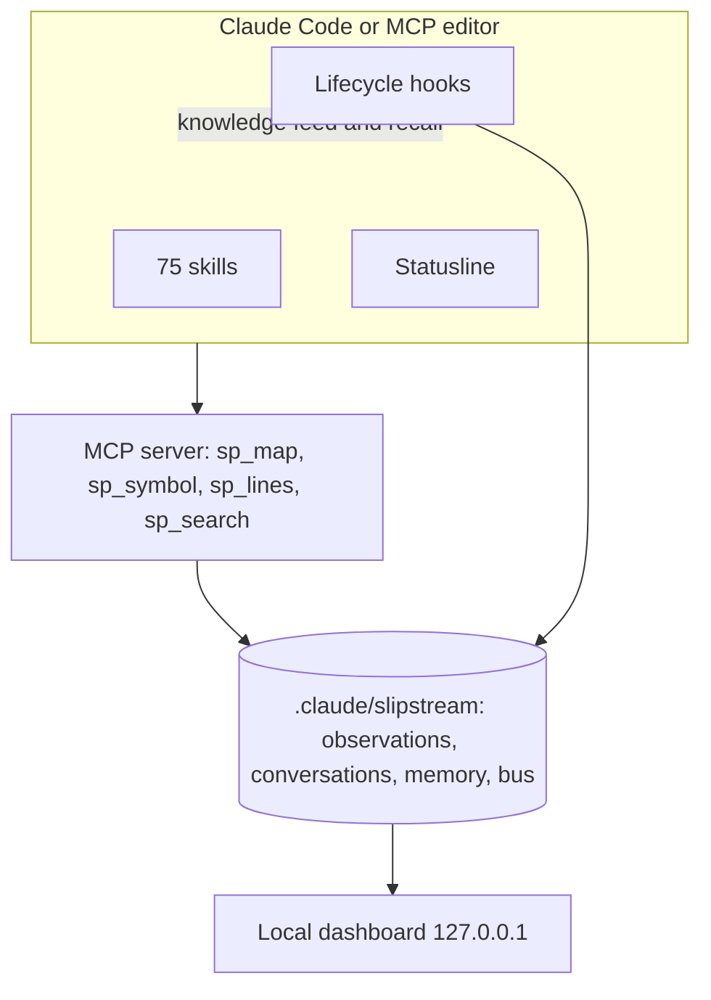
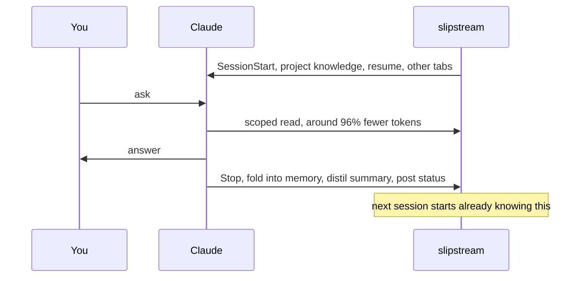

# slipstream by sarmalinux

> slipstream is not affiliated with or endorsed by Anthropic. Claude and Claude Code are trademarks of Anthropic, referenced here only to describe compatibility.

slipstream is the local memory and observability layer for Claude Code. It makes Claude remember across sessions, read far fewer tokens by pulling scoped slices instead of whole files, and shows you everything it did in a local dashboard. It installs as a Claude Code plugin and also runs as an MCP server in Cursor, Windsurf, Antigravity, VS Code and JetBrains. Everything is local, gitignored, and never leaves your machine.

## What you get

1. **Memory across sessions.** Every turn is folded into a local observation and each session is distilled into a durable summary automatically, so the next session starts knowing what the last one did. See [Memory System](Memory-System) and [Observation Memory](Observation-Memory).
2. **Cold start is never cold.** SessionStart injects a knowledge feed: what the project is, how it is organised, the most-connected files to read first, recent asks and durable memory. See [Hooks](Hooks).
3. **~96% fewer tokens per read, reproducible.** Claude pulls one symbol or line range through the scoped map instead of the whole file. Run `pnpm benchmark` to regenerate the numbers. See [Token Efficiency](Token-Efficiency) and [MCP Tools](MCP-Tools).
4. **Multiple tabs coordinate.** Open several sessions on one project and each posts what it is working on to a shared bus; every session sees the others at its next turn. Turn-boundary coordination, not live messaging.
5. **A local dashboard.** Six focused views on `127.0.0.1`: Overview, Live activity, the agents office, Sessions by day, what Claude remembers, and an interactive code map. See [Live Agent Dashboard](Live-Agent-Dashboard).
6. **Skills that steer the work.** 75 shipped skills, including a deliberate-engineering methodology set and a premium web-design track. See [Skill Catalogue](Skill-Catalogue).

## System diagram

## The session loop

## Honest limits

- Separate chats cannot message each other mid-turn; coordination happens at turn boundaries through shared memory.
- The ~96% figure is per-read, not end-to-end; real savings depend on how often the agent re-reads.
- Capture is going forward from install; it does not reconstruct history that happened before it.

## Navigation

| Page | What it covers |
|---|---|
| [Install in VS Code](Install-in-VS-Code) | Marketplace add, install, first run, doctor |
| [MCP tools](MCP-Tools) | The bundled server and every `sp_` tool |
| [Observation memory](Observation-Memory) | Self-building memory, the local embedding, three-layer search, lesson distillation |
| [Memory system](Memory-System) | The file-based store, summaries, instincts, health |
| [Memory recall](Memory-Recall) | Signal-ranked relevant recall, not load-everything |
| [Lossless compaction](Lossless-Compaction) | The PreCompact digest and the reload |
| [Cross-IDE support](Cross-IDE-Support) | Tools and dashboard in Cursor, Windsurf, Antigravity, VS Code, JetBrains |
| [Live agent dashboard](Live-Agent-Dashboard) | The six views, the API, the session loop |
| [Token efficiency](Token-Efficiency) | The reproducible before/after numbers |
| [Statusline](Statusline) | The status bar line and how to enable it |
| [Subagents](Subagents) | sp-shipper, sp-schema, sp-reviewer |
| [Architecture](Architecture) | Repo shape, modules, the data path |
| [Skill engine](Skill-Engine) | The skill contract and loader |
| [Skill catalogue](Skill-Catalogue) | The 75 skills by category |
| [Writing a skill](Writing-a-Skill) | Author a skill that passes validation |
| [Hooks](Hooks) | Every wired hook and what it emits |
| [Data formats](Data-Formats) | Map JSON, memory frontmatter, the event log |
| [Performance and benchmarks](Performance-and-Benchmarks) | Real numbers from this machine |
| [Security model](Security-Model) | Local-only, redaction, what to trust |
| [Testing strategy](Testing-Strategy) | What the 321 tests cover and why |
| [FAQ](FAQ) | Common questions |
| [Troubleshooting](Troubleshooting) | Symptoms and fixes |
