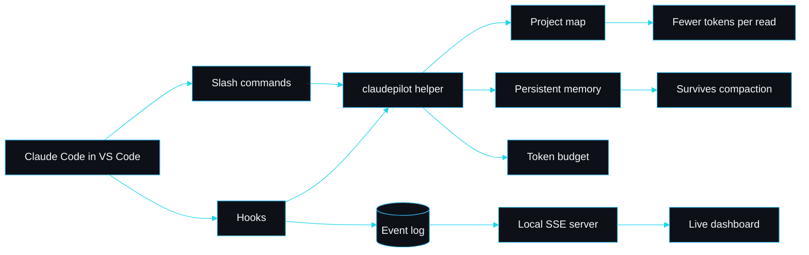

# claudepilot by sarmalinux

claudepilot is a Claude Code plugin. You install it into Claude Code in VS Code and it keeps Claude working for hours without exhausting context or wasting tokens, gives it a persistent memory that survives compaction, ships a guardrailed skill library for production sites on Cloudflare, Supabase, Vercel and Resend, and stands up a live local dashboard so you can watch the agents work.

It is not a CLI you run as a product. There is a small helper binary the plugin calls from its hooks and slash commands, but you never invoke it directly.

## Thirty-second tour

When a session starts, the dashboard boots on `127.0.0.1`, the memory index loads, and Claude is nudged to read the compact map before whole files. As it works, hooks append events to a log the dashboard tails live; durable facts go to memory; every shipping skill ends in a verification gate.

## The five pillars

1. **Token efficiency.** A compact project map, scoped retrieval by symbol or line range, hooks that nudge scoped reads, and a conservative budget estimate.
2. **Persistent memory.** One fact per file with frontmatter, a regenerated `MEMORY.md` index, loaded at session start so knowledge survives across sessions.
3. **Guardrailed skill library.** 59 agent skills; each shipping skill carries a verification gate.
4. **Mind map and status in the chat.** A themed Mermaid map and a status panel with the plan, budget and memory count.
5. **Live agent dashboard.** An auto-launching, local-only observability server: agents, activity, token budget, plan and mind map, streamed live with replay.

## Navigation

| Page | What it covers |
|---|---|
| [Install in VS Code](Install-in-VS-Code) | Marketplace add, install, first run |
| [Architecture](Architecture) | Repo shape, modules, design decisions and rejected trade-offs |
| [Live agent dashboard](Live-Agent-Dashboard) | The headline feature: hooks, event log, server, UI, replay |
| [Token efficiency](Token-Efficiency) | Map, scoped reads, the budget estimate |
| [Memory system](Memory-System) | The file-based store and recall |
| [Skill engine](Skill-Engine) | The skill contract and loader |
| [Skill catalogue](Skill-Catalogue) | The 59 skills by category |
| [Writing a skill](Writing-a-Skill) | Author a new skill that passes validation |
| [Hooks](Hooks) | Every wired hook and what it emits |
| [Mind map and status](Mind-Map-and-Status) | The in-chat diagram and status panel |
| [Integrations](Integrations) | Cloudflare, Supabase, Vercel, Resend |
| [Troubleshooting](Troubleshooting) | Concrete symptoms and fixes |
| [Roadmap and limitations](Roadmap-and-Limitations) | What I will and will not add |

---
SarmaLinux . sarmalinux.com . [Repository](https://github.com/sarmakska/claudepilot)
