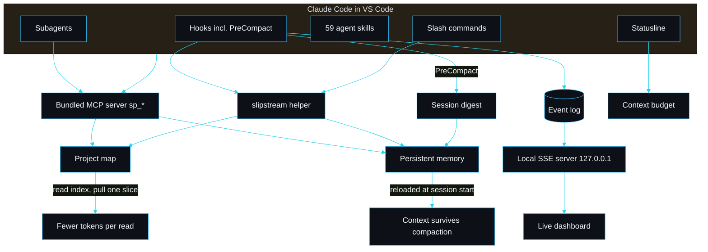

# slipstream by sarmalinux

> slipstream is not affiliated with or endorsed by Anthropic. Claude and Claude Code are trademarks of Anthropic, referenced here only to describe compatibility.

slipstream is a Claude Code plugin. You install it into Claude Code in VS Code and it makes Claude work through precise tools instead of whole-file reads, keeps context alive across compaction, ships a guardrailed skill library for production sites on Cloudflare, Supabase, Vercel and Resend, and stands up a live local dashboard so you can watch the agents work.

It is not a CLI you run as a product. There is a small helper binary the plugin calls from its hooks, its slash commands and a bundled MCP server, but you never invoke it directly.

## What you feel on day one

1. **Claude works through precise tools.** A bundled MCP server exposes `sp_map`, `sp_symbol`, `sp_lines` and `sp_search`, so Claude pulls one declaration instead of opening the whole file. See [MCP tools](MCP-Tools) and [Token efficiency](Token-Efficiency).
2. **Memory builds itself, and you can search it.** Every turn is captured as a compact observation and made semantically searchable through a three-layer search (`sp_search_memory` → `sp_timeline` → `sp_observations`), so past work is recoverable without anyone writing it down. See [Observation memory and semantic search](Observation-Memory).
3. **Context survives compaction.** A `PreCompact` hook writes a structured digest before Claude Code trims the conversation; the next session reloads it. See [Lossless compaction](Lossless-Compaction).
4. **You watch the agents in a dashboard.** Session start boots a `127.0.0.1` server and prints the URL into chat; a Memory search panel queries your project's observations. See [Live agent dashboard](Live-Agent-Dashboard).
5. **You see the budget in the statusline.** `cp | ctx 12% ok | mem 4 | obs 37 | skill scoped-read`. See [Statusline](Statusline).

## System diagram

## Navigation

| Page | What it covers |
|---|---|
| [Install in VS Code](Install-in-VS-Code) | Marketplace add, install, first run, doctor |
| [MCP tools](MCP-Tools) | The bundled server and every `sp_` tool |
| [Observation memory and semantic search](Observation-Memory) | Self-building memory, the local embedding, three-layer search, lesson distillation |
| [Cross-IDE support](Cross-IDE-Support) | The dashboard, budget gauge and tools in Cursor, Windsurf, Antigravity, VS Code |
| [Lossless compaction](Lossless-Compaction) | The PreCompact digest and the reload |
| [Memory recall](Memory-Recall) | Signal-ranked relevant recall, not load-everything |
| [Live agent dashboard](Live-Agent-Dashboard) | Hooks, event log, server, UI, replay |
| [Statusline](Statusline) | The status bar line and how to enable it |
| [Output style](Output-Style) | The terse, token-lean style |
| [Subagents](Subagents) | sp-shipper, sp-schema, sp-reviewer |
| [Token efficiency](Token-Efficiency) | The worked before/after numbers |
| [Architecture](Architecture) | Repo shape, modules, the data path |
| [Memory system](Memory-System) | The file-based store and the index |
| [Skill engine](Skill-Engine) | The skill contract and loader |
| [Skill catalogue](Skill-Catalogue) | The 59 skills by category |
| [Writing a skill](Writing-a-Skill) | Author a skill that passes validation |
| [Hooks](Hooks) | Every wired hook and what it emits |
| [Configuration and tuning](Configuration-and-Tuning) | Every knob and env var |
| [Data formats](Data-Formats) | Map JSON, memory frontmatter, the event log |
| [Performance and benchmarks](Performance-and-Benchmarks) | Real numbers from this machine |
| [Design decisions](Design-Decisions) | Choices made and alternatives rejected |
| [Security model](Security-Model) | Local-only, redaction, what to trust |
| [Testing strategy](Testing-Strategy) | What the 120 tests cover and why |
| [Examples and recipes](Examples-and-Recipes) | Copy-paste flows |
| [Comparisons](Comparisons) | Versus the obvious alternatives |
| [Integrations](Integrations) | Cloudflare, Supabase, Vercel, Resend |
| [Contributing](Contributing) | Build, test, write an extension |
| [FAQ](FAQ) | Common questions |
| [Troubleshooting](Troubleshooting) | Symptoms and fixes |
| [Roadmap and limitations](Roadmap-and-Limitations) | What I will and will not add |

---
SarmaLinux . sarmalinux.com . [Repository](https://github.com/sarmakska/slipstream)
