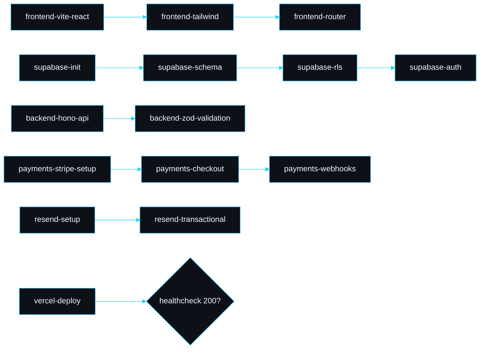

# Integrations

claudepilot's skill library targets the stack people actually ship production sites on. This page shows how the integration skills fit together for a real deployment, and what each one's verification gate proves.

## A typical build, end to end

## Cloudflare

`cloudflare-worker` scaffolds a Worker and wrangler config; `cloudflare-pages` wires the site; `cloudflare-d1`, `cloudflare-kv` and `cloudflare-r2` add the data bindings; `cloudflare-secrets` manages secrets. Gates verify a dry-run deploy or a local migration applies.

## Supabase

`supabase-init` brings up the local stack; `supabase-schema` defines tables; `supabase-rls` locks them down with row level security; `supabase-auth` wires sessions; `supabase-storage` adds buckets; `supabase-typegen` regenerates types and checks they compile; `supabase-edge-function` deploys a function. The RLS skill is the one to never skip; its gate proves a non-owner cannot read another user's rows.

## Vercel

`vercel-link` connects the project, `vercel-env` syncs environment variables, `vercel-preview` ships a preview, and `vercel-deploy` goes to production with a healthcheck gate that curls the URL and requires a 200.

## Resend

`resend-setup` adds the API key, `resend-domain` verifies the sending domain, `resend-transactional` sends receipts and password resets, and `resend-webhook` handles delivery events. Gates smoke-test that the API accepts a message.

## Auth and payments

`auth-session`, `auth-oauth`, `auth-rbac` and `auth-password-reset` cover the common auth surfaces. `payments-stripe-setup`, `payments-checkout`, `payments-subscriptions` and `payments-webhooks` cover one-time and recurring payments, with webhook handling gated so you do not ship a silent endpoint.

## SEO and analytics

`seo-meta-tags`, `seo-open-graph`, `seo-sitemap` and `seo-structured-data` make the site discoverable and shareable. `analytics-plausible`, `analytics-events` and `analytics-web-vitals` add privacy-friendly analytics and performance signals.

## Git and release

`git-init-repo`, `git-conventional-commit`, `git-feature-branch`, `git-pull-request` and `git-release-tag` keep the history clean and releases tagged.

## A note on credentials

Several skills touch secrets (Cloudflare, Supabase, Vercel, Resend, Stripe). Record where they live, not the values, with a `credential-location` memory, so the next session knows where to look without leaking anything into the transcript.

---
SarmaLinux . sarmalinux.com . [Repository](https://github.com/sarmakska/claudepilot)
