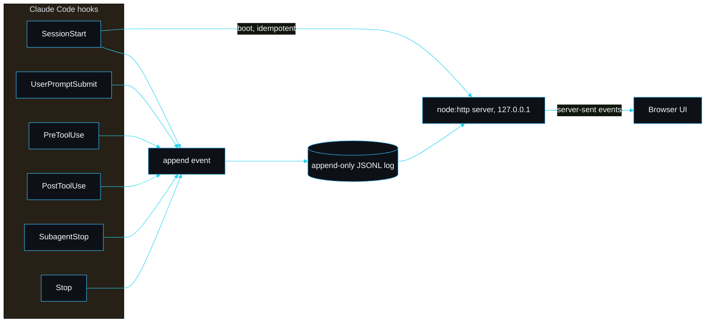

# Live agent dashboard

The headline feature, pillar five. A local observability dashboard for a coding session. It auto-starts when a session begins, binds `127.0.0.1` on a free port, and streams a live view to your browser. It watches and visualises the session; it does not control the agents.

In Claude Code it is driven by the plugin hooks. In any other MCP editor (Cursor, Windsurf, Antigravity, VS Code) the bundled MCP server feeds and auto-starts it instead, so the dashboard works there too — see [Cross-IDE support](Cross-IDE-Support).

Everything stays on the machine: local-only bind, no telemetry, no account, and obvious secrets are redacted before they ever reach disk.

## Agents office

Open several Claude Code tabs on one project and each appears as a working character at a desk, fed live by the shared bus. The characters animate while their tab is active and dim when idle, so you can watch the whole team at once while they coordinate instead of duplicating work.


## The panels

- **Agents** — every agent and subagent, its status, and the task it is on.
- **Discussion / activity** — the per-agent stream of prompts, tool calls and results.
- **Token budget** — a gauge that fills as context is pulled in, with ok/warn/compact zones from `budget.json`, a "set budget" panel (target + thresholds, written to `budget.json`), and a source label: `actual` when the true count was read from the host transcript, `estimated` otherwise. See [Cross-IDE support](Cross-IDE-Support) and [Token efficiency](Token-Efficiency).
- **Session work** — files touched, a tool-use breakdown, cumulative tokens, and how much slipstream **optimised** (saved tokens and the percentage trimmed versus whole-file reads).
- **Plan and mind map** — the current plan and a themed Mermaid map of the session.
- **Memory search** — type a query to search the project's [observation memory](Observation-Memory); click a hit to expand its full detail, fetched lazily.

## How it fits together



The flow is: hook fires, hook appends one JSON event to `.claude/slipstream/dashboard/<session>.jsonl`, the server tails that log, folds the events into state, and pushes the state to every connected browser over server-sent events. The same fold reconstructs a finished session from its log, which is replay.

## The event schema

Defined and validated in `src/dashboard/events.ts` (`eventSchema`). One JSON object per line:

```jsonc
{
  "seq": 3,                       // monotonic within the session, set by the writer
  "ts": "2026-05-31T19:37:10Z",   // set at write time
  "session": "demo",              // which session this belongs to
  "agent": "main",                // "main" or a subagent id
  "kind": "post-tool",            // one of the lifecycle kinds below
  "label": "Read src/app.tsx",    // short, already redacted
  "data": { "bytes": 42000 }      // optional, already redacted
}
```

The kinds (`EVENT_KINDS`) are `session-start`, `user-prompt`, `pre-tool`, `post-tool`, `subagent-start`, `subagent-stop`, `stop`. An event is a fact that already happened; nothing rewrites a written event, so state is a pure fold over the log (`reduceEvents` in `src/dashboard/state.ts`).

### Who writes what

| Hook | File | Event |
|---|---|---|
| SessionStart | `hooks/session-start.mjs` | `session-start`, and boots the server |
| UserPromptSubmit | `hooks/user-prompt-submit.mjs` | `user-prompt` with the prompt as the label |
| PreToolUse | `hooks/pre-tool-use.mjs` | `pre-tool` with the tool and target |
| PostToolUse | `hooks/post-tool-use.mjs` | `post-tool` with the bytes pulled into context |
| SubagentStop | `hooks/subagent-stop.mjs` | `subagent-stop` against the subagent id |
| Stop | `hooks/stop.mjs` | `stop` |

All six route through `hooks/emit.mjs`, which reads the hook payload, derives the session id, builds a redacted event and shells out to `slipstream dashboard emit`. Emission is fire-and-forget and detached, so a hook never blocks the agent and a failure to record is swallowed.

## The append-only, concurrency-safe writer

`src/dashboard/log.ts`. Several hooks can fire in the same instant, each in its own short-lived Node process. A naive read-modify-write of a sequence counter would lose events. Instead:

- We only ever open the log with the append flag and write whole lines.
- `appendEvent` takes a small advisory lock (an `O_EXCL` marker file), reads the next sequence from the file it is about to extend, then appends. The lock makes the read-then-append atomic across processes, so two racing hooks never pick the same `seq`.
- The lock is best-effort with a short timeout and stale-lock recovery: if it cannot be taken we still append, because a duplicate sequence is survivable but a dropped event is not. A hook must never wedge.

This is covered by a test that fires 25 parallel writers and asserts 25 events with unique, contiguous sequences.

## The server

`src/dashboard/server.ts`, built on `node:http` with no framework. It binds `127.0.0.1` (port 0 lets the OS pick a free port), serves the self-contained UI at `/`, streams `/api/stream` as server-sent events, and exposes small JSON routes: `/api/sessions`, `/api/state`, `/api/budget` (GET the gauge + config, POST to set the budget), `/api/savings` (the optimization tally), `/api/observation/<id>` (full detail, also the citation endpoint) and `/api/search?q=` (memory search). A poll loop tails the active session logs and pushes a fresh `state` frame whenever the log grows. The body reader caps POSTs at 64 KB.

Idempotent start lives in `src/dashboard/launch.ts`. `startDashboard` reads `server.json`, checks the recorded pid is alive and the recorded port is actually listening, and reuses that server if so. Only when there is no live server does it spawn a detached `runner.ts` process. So a resume, a reload or a second `SessionStart` will not stack up servers.

## Worked example

Record a session end to end with the helper and replay it:

```bash
npx slipstream dashboard emit --root . --session demo --kind session-start --label "session started"
npx slipstream dashboard emit --root . --session demo --kind user-prompt   --label "build the marketing site"
npx slipstream dashboard emit --root . --session demo --kind pre-tool      --label "Read src/app.tsx"
npx slipstream dashboard emit --root . --session demo --kind post-tool     --label "Read done" --bytes 42000
npx slipstream dashboard emit --root . --session demo --kind subagent-stop --agent worker-1 --label "subagent finished"
npx slipstream dashboard emit --root . --session demo --kind stop          --label "turn finished"

npx slipstream dashboard replay --root . --session demo
```

Replay prints the reconstructed state:

```
# replay of session demo
agents: 2, events: 6
  main [waiting] 1 tools, ~11667 tokens
  worker-1 [done] 0 tools, ~0 tokens
```

The `~11667` is the 42,000-byte read converted at slipstream's 3.6 bytes-per-token estimate. That is the same number the live token-budget bar shows.

## Before and after: a token budget

The dashboard makes the cost of a read visible. The same task two ways, "rename a prop in a 42 KiB component":

| | Without slipstream | With slipstream |
|---|---|---|
| Read | whole file, 42,000 bytes | map slice + one symbol, about 1,800 bytes |
| Approximate tokens | ~11,667 | ~500 |
| Budget bar | lurches ~6% of a 200k window | barely moves |

## Configuration

Optional `.claude/slipstream/dashboard.json` under your project:

```jsonc
{
  "enabled": true,    // auto-start on SessionStart
  "autoOpen": true    // open the browser on first start
}
```

Environment overrides, useful per session: `SLIPSTREAM_DASHBOARD=0` disables the dashboard, `SLIPSTREAM_DASHBOARD_OPEN=0` keeps the browser shut. The localhost URL is always printed in the chat as a fallback.

## Replay

Because the log is the source of truth, any recorded session can be replayed, not just the live one. List sessions with `npx slipstream dashboard sessions .`, then either replay in the terminal (`dashboard replay --session <id>`) or pick the session from the header dropdown in the UI. The server reconstructs state from the log and serves it the same way it serves a live session.

## Troubleshooting

**Port already in use.** The server binds port 0, so the OS hands it a free port; you should never hit a clash. If `server.json` points at a dead server, `startDashboard` detects the dead pid or closed port and clears the record, then spawns a fresh one. Delete `.claude/slipstream/dashboard/server.json` to force a clean start.

**The browser did not open.** Auto-open is best-effort and skipped on headless or sandboxed boxes. Use the URL printed in the chat, or run `npx slipstream dashboard start . --open`.

**No events showing.** Confirm the hooks are wired (`npx slipstream plugin-validate` lists `PostToolUse` and `SubagentStop`) and that Node is on PATH so the hooks can run. Check the log exists and is growing: `cat .claude/slipstream/dashboard/<session>.jsonl`. If the file has lines but the UI is empty, you are probably viewing a different session in the dropdown.

**A secret appeared in the stream.** Redaction is blunt and pattern-based (`redactSecrets` in `events.ts`). If a pattern slipped through, it is a bug worth reporting; redaction runs before the event is written, so the log is scrubbed too.

**The dashboard will not start in a dev checkout.** The hook imports the compiled launcher from `dist/`. Run `pnpm build` first.

---
SarmaLinux . sarmalinux.com . [Repository](https://github.com/sarmakska/slipstream)
