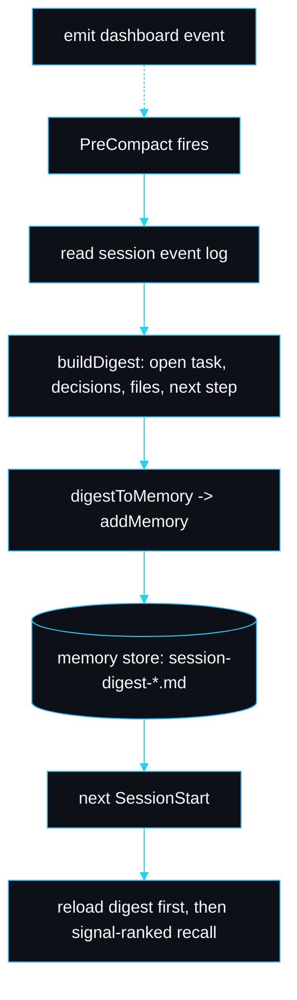

# Lossless compaction

A long Claude Code session eventually compacts: it summarises the conversation and drops the bulk of the transcript so it can keep going. That summary is lossy by nature. The open task, the decisions made and the next step often blur, and the session loses the thread it was holding. slipstream makes compaction lossless by intercepting the exact moment before it happens.

## The hook

Claude Code fires a `PreCompact` event just before it compacts, with a `trigger` field (`manual` for `/compact`, `auto` when the window fills) and optional `custom_instructions`. slipstream wires it in `hooks/hooks.json`:

```json
"PreCompact": [
  { "hooks": [ { "type": "command",
    "command": "node \"${CLAUDE_PLUGIN_ROOT}/hooks/pre-compact.mjs\"" } ] }
]
```

`hooks/pre-compact.mjs` runs, builds a digest, writes it to the memory store as a durable fact, and emits a dashboard event so the compaction is visible. It never throws: a handler that crashed could interfere with compaction, so every failure path degrades to a no-op.

## What a digest is

A digest is not a transcript. It is the small set of fields that carry the thread forward, defined as `SessionDigest` in `src/memory/digest.ts`:

- `openTask` the single most important field, one line.
- `decisions` choices made this session, each a short line.
- `filesTouched` deduplicated relative paths.
- `nextSteps` the concrete next step on resume.
- plus `session`, `takenAt` and `trigger`.

`buildDigest` reconstructs these from what the dashboard already recorded. The open task is the `custom_instructions` hint, or the most recent activity line. Decisions are activity lines that read like a choice (matched by a deliberately inclusive heuristic: words like *decided*, *chose*, *use*, *because*). Files are carried from `pre-tool` and `post-tool` events.



## Where it is stored

The digest becomes a memory of type `todo` named `session-digest-<session>` (`digestMemoryName`). It carries the tags `session-digest`, `compaction` and the file stems it touched, so [memory recall](Memory-Recall) can match it to a resumed branch. The body is rendered by `digestToMarkdown` with `**Open task:**`, `**Decisions made:**`, `**Files touched:**` and `**Next steps:**` sections.

## The reload

`hooks/session-start.mjs` reloads the digest before anything else. It looks up the digest for this session by name, falls back to the most recent `session-digest`-tagged memory, and injects its body into the session as `additionalContext`. Only then does it run signal-ranked recall on the rest of the store. So a resumed session sees its own open task and decisions first, then the relevant durable facts, then the index.

## Worked example

The digest test (`tests/digest.test.ts`) builds a digest from a sample event stream where the session decided to "use the raw request body for webhook verification because the parsed body breaks the signature", touched `src/payments/webhook.ts`, and had the open task "Wire the Stripe webhook handler and verify signatures". It asserts:

- the open task is captured verbatim,
- the decision about the raw body lands in `decisions`,
- the file is in `filesTouched`,
- writing then listing returns exactly one memory, and
- a next session on branch `fix/stripe-webhook` surfaces that digest first via `selectRelevant`, with the raw-body decision intact.

That is the lossless property under test: the thread that compaction would have softened is reconstructed on the next start.

## Failure modes

| Symptom | Cause | Fix |
|---|---|---|
| no digest written | the plugin `dist/` is not built, so the hook cannot import the memory module | `pnpm build`; `/slipstream:doctor` flags `precompact-hook` and `mcp-build` |
| digest open task is generic ("Resume the previous task") | the session had no recorded activity and no `custom_instructions` | nothing to fix; with no signal there is nothing to capture |
| old digest reloaded on a fresh, unrelated task | the fallback picked the most recent digest | the signal ranking will down-rank it; start a branch named for the new work so recall matches the right facts |

## See also

- [Memory recall](Memory-Recall) for how the reload chooses the relevant subset.
- [Hooks](Hooks) for the full hook wiring.
- [Memory system](Memory-System) for the store layout.

---
SarmaLinux . sarmalinux.com . [Repository](https://github.com/sarmakska/slipstream)
