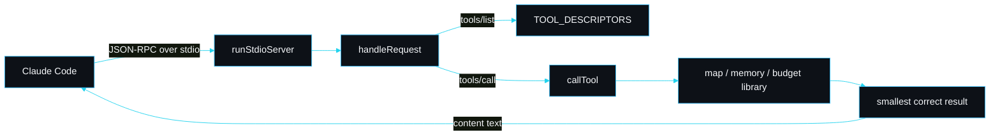

# MCP tools

The bundled MCP server is the biggest single token win in slipstream. It lets Claude work through precise calls (one symbol, one line range, one search) instead of reading whole files into context. Claude Code spawns it automatically because the plugin declares it.

## How it is declared

`.claude-plugin/plugin.json` carries an `mcpServers` block:

```json
"mcpServers": {
  "slipstream": {
    "command": "node",
    "args": ["${CLAUDE_PLUGIN_ROOT}/dist/mcp/index.js"]
  }
}
```

`${CLAUDE_PLUGIN_ROOT}` expands to the installed plugin directory, so the server resolves regardless of where the plugin lives. Claude Code launches it over stdio, sends `initialize`, then `tools/list`, then `tools/call` per invocation.

## The tools

All twelve tools, defined in `TOOL_DESCRIPTORS` in `src/mcp/tools.ts`:

| Tool | Arguments | Returns |
|---|---|---|
| `sp_map` | `root?` | the compact project map (files, exported symbols, one-line purpose). No file contents. |
| `sp_symbol` | `file`, `symbol`, `root?` | just that symbol's source slice with its doc comment. |
| `sp_lines` | `file`, `start`, `end`, `root?` | exactly the lines `start..end`. |
| `sp_search` | `query`, `limit?`, `root?` | ranked file locations. Locations, not contents. |
| `sp_remember` | `fact`, `description?`, `type?`, `tags?`, `root?` | persists a durable memory. |
| `sp_recall` | `query`, `limit?`, `root?` | the matching memory bodies, ranked by frontmatter. |
| `sp_forget` | `name`, `root?` | deletes a memory and refreshes the index. |
| `sp_search_memory` | `query`, `kind?`, `session?`, `since?`, `limit?`, `root?` | layer 1: a compact ranked index of auto-captured observations (id, time, kind, summary). |
| `sp_timeline` | `around` (id or query), `window?`, `session?`, `root?` | layer 2: the chronological neighbours of an observation or the best match for a query. |
| `sp_observations` | `ids`, `root?` | layer 3: the full detail of the observation ids you filtered down to. |
| `sp_budget` | `bytesRead?`, `windowTokens?` | the budget level (ok/warn/compact) and a token estimate. |
| `sp_mindmap` | `root?` | the project as a themed Mermaid mind map. |

Every tool description is a crisp "Use ..." trigger, because Claude reads the description to decide when to call the tool. `sp_symbol` reads "Use to read one declaration instead of a whole file."

## The three-layer memory search

`sp_search_memory`, `sp_timeline` and `sp_observations` are designed to be used in order, cheapest first, so recall never dumps full bodies into context to find the one record that matters:

1. **`sp_search_memory`** returns a compact index (~one line per hit: id, time, kind, summary). Scan it and pick the ids worth more.
2. **`sp_timeline`** shows what was happening around an interesting hit, still as one-liners.
3. **`sp_observations`** fetches full detail only for the ids you kept — the only call that returns bodies.

Each observation id is a stable citation handle. Ranking is hybrid: a local semantic vector blended with exact-term overlap. See [Observation memory and semantic search](Observation-Memory) for how capture and ranking work.

## The request path



The transport is a newline-delimited JSON-RPC 2.0 loop in `runStdioServer` (`src/mcp/server.ts`). It buffers stdin, splits on newlines, parses each line, dispatches through `handleRequest`, and writes one response line per request. Notifications (no `id`, for example `notifications/initialized`) get no response, as the protocol requires.

`handleRequest` is pure and exported, so a test can feed it a request object and assert on the response with no process at all. The only protocol methods slipstream implements are `initialize`, `notifications/initialized`, `ping`, `tools/list` and `tools/call`; anything else returns JSON-RPC error `-32601` (method not found).

## The discipline that cannot be bypassed

The design rule for every tool is: return the smallest correct thing. It lives in `callTool` (`src/mcp/tools.ts`), so it is structural, not advisory.

- `sp_map` calls `mapToMarkdown`, which renders the index from `FileEntry` records that never hold source. There is no path by which a file body reaches the map.
- `sp_symbol` calls `retrieveSymbol`, which walks braces from the declaration line to find the symbol's span and returns only those lines plus a leading doc comment. The test in `tests/mcp.test.ts` asserts the slice is shorter than the file and does not contain a later, unrelated declaration.
- `sp_search` calls `searchMap`, which scores files by path, symbol and purpose and returns `{ path, purpose, score, symbols }`. No body.

## Worked example

Against the fixture project (`fixtures/sample-project`), a `sp_symbol` call for `greet`:

```
$ printf '%s\n' \
  '{"jsonrpc":"2.0","id":1,"method":"initialize"}' \
  '{"jsonrpc":"2.0","id":3,"method":"tools/call","params":{"name":"sp_symbol","arguments":{"file":"src/greet.ts","symbol":"greet"}}}' \
  | node dist/mcp/index.js
```

returns the eleven-line `greet` function with its doc comment, and nothing else from the file. The whole file holds `Greeting`, `Salutation`, `greet` and `DEFAULT_GREETING`; the slice holds only `greet`. See [Token efficiency](Token-Efficiency) for the byte and token figures.

## Failure modes

| Symptom | Cause | Fix |
|---|---|---|
| `sp_symbol` returns `no symbol "X" in file` | the symbol is not exported, so the map does not index it | the map only carries the public surface; read the file's exports with `sp_map`, or use `sp_lines` for a non-exported symbol |
| tools do not appear in Claude Code | `dist/mcp/index.js` is missing | run `pnpm build` in the plugin; `/slipstream:doctor` flags this as `mcp-build` |
| the server starts but answers nothing | a non-JSON line was written to stdout | only framed responses go to stdout; all logging goes to stderr (`src/mcp/server.ts`) |
| a tool throws | bad arguments or an unreadable root | `callTool` catches and returns an `isError` result rather than crashing the transport |

## See also

- [Token efficiency](Token-Efficiency) for the before/after numbers.
- [Observation memory and semantic search](Observation-Memory) for the three-layer search and how observations are captured.
- [Memory recall](Memory-Recall) for how `sp_recall` ranks.
- [Design decisions](Design-Decisions) for why the SDK was not used.

---
SarmaLinux . sarmalinux.com . [Repository](https://github.com/sarmakska/slipstream)
