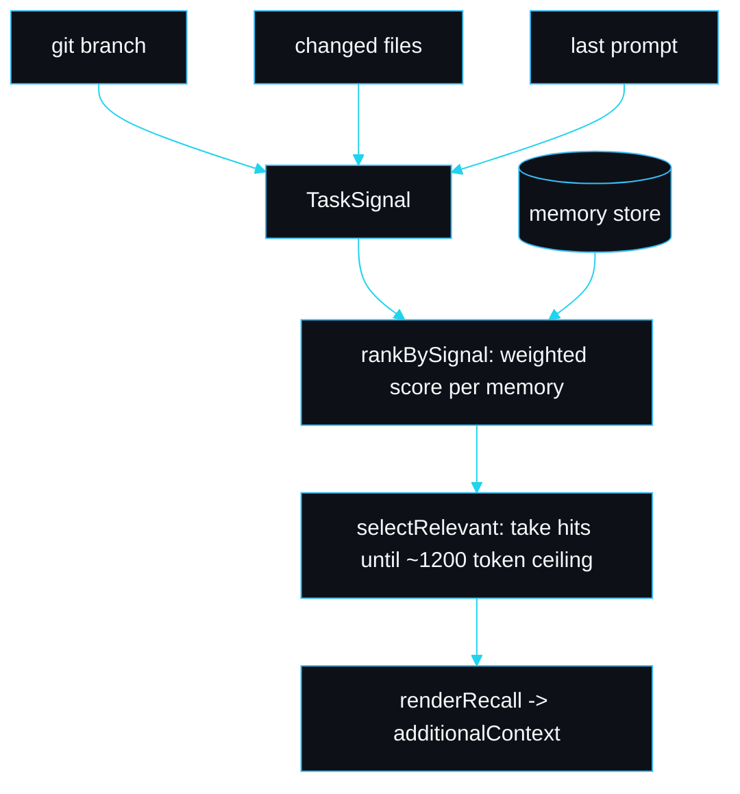

# Memory recall

The naive thing a memory layer does is dump the whole store back into context on every session. slipstream does not, because that gets more expensive the more useful the store becomes: a store of fifty facts would cost more tokens to reload than the session saves. Instead it builds a task signal from what the session is actually about, ranks memories against it, and reloads only the subset that earns its place, under a hard token ceiling.

## The task signal

The signal has three honest sources, gathered cheaply at session start (`hooks/session-start.mjs`, `taskSignal`):

| Source | How it is read | Why it tells us something |
|---|---|---|
| git branch | `git rev-parse --abbrev-ref HEAD` | a branch named `fix/stripe-webhook` is a strong hint about the work |
| changed files | `git diff --name-only HEAD` | the working set names the concepts in play |
| last prompt | the `prompt` field on the payload | what the human just asked for |

None of these reads a file's contents, so the signal itself is nearly free. The signal type is `TaskSignal` in `src/memory/recall.ts`.

## The ranking

`rankBySignal` scores each memory against the signal. The weights are ordered by how much each cue tells us:

```
branch match      4
tag match         3
file+tag overlap  3 + 3
description match  2
loose haystack    0.5
```

A branch match is the strongest single cue (someone named the branch after the work). A changed file whose stem matches a memory tag is the strongest combined cue. Each hit records *why* it matched (`reasons`), which is surfaced in the reloaded block so you can see the ranking is honest, not magic.



## The budget ceiling

`selectRelevant` takes hits in score order and stops when the approximate token cost would exceed `RECALL_TOKEN_BUDGET` (1,200 tokens, ~3.6 bytes per token). That keeps a SessionStart reload bounded no matter how large the store grows. The recall test builds a store of fifty 400-byte stripe facts and asserts the reloaded subset stays under the ceiling and is smaller than the store.

## The empty-signal rule

With no branch, no diff and no prompt, `selectRelevant` returns nothing and the session falls back to the `MEMORY.md` index alone. This is deliberate: loading arbitrary memories with no signal is exactly the load-everything behaviour the whole feature avoids. The test pins this (`returns nothing with no signal`).

## Worked examples (from the test suite)

| Signal | Top hit | Why |
|---|---|---|
| branch `fix/stripe-webhook` | `stripe-webhook-signing` | branch terms match the name and tags |
| changed files `src/lib/resend.ts`, `src/emails/welcome.tsx` | `resend-from-domain` | file stem `resend` matches the tag |
| prompt "add an RLS policy to the orders table" | `supabase-rls-default-deny` | prompt term `rls` matches the tag |

## The two recall paths

There are two ways to recall, for two situations:

- **Automatic, at session start.** Signal-ranked `selectRelevant`, described above. You do nothing.
- **On demand, mid-session.** `sp_recall(query)` (the MCP tool) or `/slipstream:recall`, which calls `recallMemories` in `src/memory/store.ts`. This is a free-text query ranking, used when you want a specific prior decision rather than the session's relevant subset.

## Failure modes

| Symptom | Cause | Fix |
|---|---|---|
| relevant memory not reloaded | its tags do not match the branch or files | add a tag that names the concept (recall scores tags highest after the branch) |
| nothing reloaded at all | not a git repo and no prompt, so the signal is empty | the index still loads; recall on demand with `/slipstream:recall` |
| too many memories reloaded | several share a strong tag | they still fit under the 1,200 token ceiling; prune stale facts with `/slipstream:forget` |

## See also

- [Lossless compaction](Lossless-Compaction) for the digest that is reloaded first.
- [Memory system](Memory-System) for the store layout and the index.
- [Configuration and tuning](Configuration-and-Tuning) for the recall budget.

---
SarmaLinux . sarmalinux.com . [Repository](https://github.com/sarmakska/slipstream)
