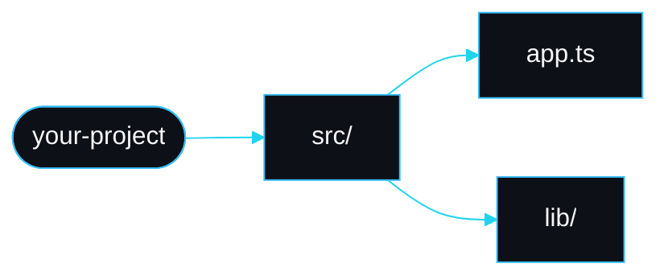

# Mind map and status

claudepilot renders the project mind map and a live status panel inside the Claude Code chat. The primary experience is in-chat; a self-contained HTML artifact is available when you want something to open in a browser or attach to a pull request.

## The mind map in chat

`/claudepilot:mindmap` runs `npx claudepilot mindmap .`, which builds a tree from the project map (`buildMindMap`) and renders it as a Mermaid flowchart themed with the SarmaLinux palette (`mindMapToMermaid`). Claude includes the Mermaid block in its reply, so you see the diagram rendered in chat.



The chat diagram collapses to directories and files and drops symbol leaves, to stay readable. The HTML artifact keeps more detail.

## The status panel

`/claudepilot:status` runs `npx claudepilot status . --bytes <estimate>` and prints:

- the project size (files and exported symbols),
- the approximate context budget with its level (`ok`, `warn` or `compact`) and the matching advice,
- the number of durable memories stored,
- the project mind map.

Use it to decide whether to keep going or to compact. At `compact`, run the `compact-and-offload` skill: it summarises the session and writes durable facts to memory before you compact.

## The HTML artifact

```
npx claudepilot mindmap . --html .claude/claudepilot/mindmap.html
```

`renderArtifact` writes a single self-contained HTML file with the SarmaLinux palette, the project stats, and the Mermaid mind map loaded from a CDN. Open it in a browser to share the picture outside the chat.

## Failure modes

- The Mermaid block does not render. Confirm your chat client renders Mermaid; the raw block is still readable as text. The diagram always begins with a `flowchart LR` header after the theme init line.
- The diagram is huge. The chat renderer caps the node count. For the full picture use the HTML artifact, which raises the cap.
- The budget shows 0 percent. You did not pass `--bytes`. Give it your rough bytes-read estimate for the session.

---
SarmaLinux . sarmalinux.com . [Repository](https://github.com/sarmakska/claudepilot)
