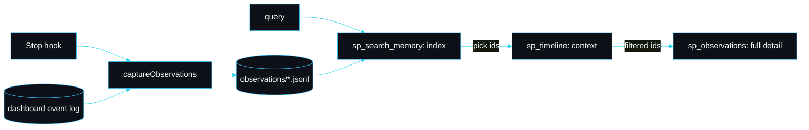

# Observation memory and semantic search

slipstream's [memory system](Memory-System) holds the facts you *choose* to keep: a decision, a convention, a gotcha you saved with `/slipstream:remember`. Observation memory is the other half — the memory that **builds itself**. Every turn of work leaves a compact, searchable record without anyone deciding it was worth keeping, so weeks later "when did we touch the Stripe webhook, and why" has an answer you never had to write down.

It is built from three pieces, all pure TypeScript with no database, no native module and no Python: a local embedding (`src/memory/embed.ts`), an observation store and capture step (`src/memory/observe.ts`), and a three-layer search (`src/memory/search.ts`).

## Where observations come from

slipstream already records every lifecycle event to an append-only log for the [live dashboard](Live-Agent-Dashboard). That log is a faithful, redacted record of what happened. Observation capture folds that stream into durable records:

- The `Stop` hook (`hooks/stop.mjs`) fires `slipstream observe` after each turn. It is detached and swallowed, so capturing memory never blocks or breaks the session.
- `captureObservations` reads the session's events **after a stored cursor**, folds the turns that have closed into observations, appends them under a lock with project-wide ids, and advances the cursor. Running it twice adds nothing the second time — capture is incremental and idempotent.
- A turn runs from a user prompt (or the first activity) until a `stop` event closes it. An unterminated trailing turn is left unconsumed so the next capture picks it up once it has closed. That is what makes per-turn capture safe to run continuously without duplicating or losing a turn.

The fold itself (`foldObservations`) is pure: no IO, no clock, no id source beyond the start id it is handed, so a test pins every field.

## What an observation is

One compressed unit of session activity, stored as one JSON line per record under `.claude/slipstream/observations/<session>.jsonl`:

```jsonc
{
  "id": 1,                       // project-wide monotonic; this is the citation handle
  "session": "main",
  "ts": "2026-06-04T10:02:00.000Z",
  "kind": "edit",                // edit | read | command | search | prompt | note
  "summary": "fix the stripe webhook signature verification — Read, Edit (1 file)",
  "detail": "Request: ...\nTools: Read, Edit\nFiles:\n  - src/payments/webhook.ts",
  "files": ["src/payments/webhook.ts"],
  "tags": ["edit", "webhook", "read"],
  "vector": [/* 256 floats, the local embedding */]
}
```

`kind` is the dominant activity: a turn that edits is an `edit` even if it also reads. The `summary` is what the cheap search index shows; the `detail` is what you pay for only when you fetch the full record. Vectors are rounded to five decimals so the file stays compact without changing cosine ranking.

## The local embedding

`embed(text)` turns text into a unit-length 256-float vector. It is a **hashed term-frequency model**: tokenise into unigrams and bigrams (splitting camelCase and snake_case so `retrieveSymbol` matches a spaced query), hash each term into the vector with a sublinear frequency weight and a sign bit, then L2-normalise. Cosine similarity of two vectors is then a dot product.

It is deterministic — the same text always yields the same vector, so a vector written months ago still compares correctly against a query embedded today (nothing here touches `Math.random` or a clock). It is honest about what it is: a cheap, offline, lexical-semantic vector, not a learned transformer embedding. It makes "find the observation about the auth bug" work without exact-string luck, which is the whole point.

## The three-layer search

The expensive thing about recall is tokens. Dumping full bodies into context to find the one that matters wastes most of what you pay for. So search is split into three calls that get progressively more expensive, and you only pay for depth where you have already decided the result is worth it.

| Layer | Tool / CLI | Returns |
|---|---|---|
| 1. Index | `sp_search_memory` / `memory search` | a compact ranked index: id, time, kind, one-line summary. Cheap. Scan and pick here. |
| 2. Context | `sp_timeline` / `memory timeline` | the chronological neighbours of an interesting result (by id or by best match for a query). |
| 3. Detail | `sp_observations` / `memory observations` | the full bodies, but only for the ids you filtered down to. |

Ranking is **hybrid**: a semantic score (cosine over the stored vector) blended with a lexical overlap bonus (the fraction of query tokens that literally appear). The lexical term guarantees a result that contains the words outranks one that is only semantically near. Ties break by recency.



## Using it

In Claude Code, just ask — Claude reaches for `sp_search_memory` first, then `sp_timeline`, then `sp_observations` on the ids it kept. From the helper CLI:

```bash
node dist/cli/index.js memory search "stripe webhook signature"
node dist/cli/index.js memory timeline 1 --window 2
node dist/cli/index.js memory observations 1 2
node dist/cli/index.js observe --session main      # capture manually (the Stop hook does this for you)
```

The [live dashboard](Live-Agent-Dashboard) also has a **Memory search** panel: type a query, get the ranked index, click a hit to expand its full detail (fetched lazily from `/api/observation/<id>`), so the index stays cheap until you ask for a body.

## Lessons: distilling what recurs

Over time the same areas of a project get touched again and again. `sp_lessons` (and `slipstream memory lessons`) distil that: they cluster observations by the file and concept stems the work centred on, and surface the topics that recur — how many times, across how many sessions, which files, and what kind of work it mostly was — each with the observation ids behind it. It is a fast answer to "what does this project keep making me do", and a source of durable facts worth promoting to a hand-authored memory with `sp_remember`. Distillation (`src/memory/lessons.ts`) is a pure function over the loaded observations, so its ranking is pinned by tests.

```bash
node dist/cli/index.js memory lessons --min 3
# - Recurring work on "webhook": 6 observations across 3 sessions, mostly edit; files: src/payments/webhook.ts. [obs 1, 2, 5, …]
```

## Conversation search: when did we talk about X

Observation search answers "what did we *do*". A second, complementary search answers "when did we *talk* about X" over the full captured chat, not just the work summaries. It is deliberately separate and deliberately simple: a pure, deterministic lexical match (`searchConversations` in `src/memory/conversation-search.ts`) that the dashboard exposes at `/api/search/conversation`, with no embedding and no index to keep warm.

The score is the fraction of query words present in each exchange's ask and summary, plus a small bonus when the exact phrase appears. The one piece of real judgement is in *how* a word counts:

| Match | Weight | Example for query `auth` |
|---|---|---|
| whole word | 1.0 | "wire up the **auth** flow" |
| incidental substring | 0.4 | "rename the **auth**or column" |
| absent | 0 | "fix the billing bug" |

A whole-word hit always outranks an exchange where the term only appears inside a larger word, so searching `auth` surfaces the authentication work above an incidental "author", while the substring match is still kept rather than dropped. This preserves recall while sharpening relevance, and the ranking is pinned by tests (`tests/conversation-search.test.ts`).

## Citations

Every observation has a stable project-wide id. That id is the citation handle: reference `#1` in a discussion and anyone can fetch the full record with `sp_observations` or open `http://127.0.0.1:<port>/api/observation/1` while the dashboard runs.

## Privacy and limits

- Observations are derived from the dashboard event log, which is **redacted before it reaches disk** (see [Security model](Security-Model)). Obvious secrets are masked in both logs and observations.
- Everything is **local**. The store is plain JSONL under your project; nothing leaves the machine and there is no telemetry.
- The embedding is lexical-semantic, not a learned model. It is excellent at "find the turn that mentioned X" and good at near-synonyms; it will not reason about meaning the way a large embedding model would. That is a deliberate trade for zero dependencies.

## See also

- [Memory system](Memory-System) — the hand-authored fact store this complements.
- [MCP tools](MCP-Tools) — the `sp_*` surface, including the three search tools.
- [Memory recall](Memory-Recall) — signal-ranked recall of hand-authored facts at session start.
- [Data formats](Data-Formats) — the exact observation and event shapes.

---
SarmaLinux . sarmalinux.com . [Repository](https://github.com/sarmakska/slipstream)
