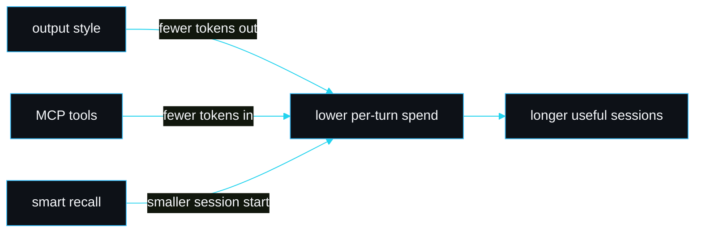

# Output style

slipstream ships an output style, `output-styles/slipstream.md`, tuned for terse, high-signal, token-lean responses. Day-to-day use under this style spends fewer tokens per turn because Claude stops restating the question, stops padding, and stops pasting back unchanged code.

## What it changes

The style is a normal Claude Code output style with frontmatter (`name`, `description`) and a body of rules. The rules fall into four groups:

- **Voice.** Answer the question, do not restate it, no preamble, no closing pleasantries. Short declarative sentences. One code block or one short list over three paragraphs.
- **Retrieval discipline.** Orient with `sp_map` before reading files, pull one symbol with `sp_symbol` or a window with `sp_lines`, use `sp_search` to find things, check `sp_budget` when a turn has read a lot.
- **Memory discipline.** Persist durable decisions with `sp_remember`; recall a prior decision with `sp_recall` before acting on it.
- **Output.** When changing code, state the file and symbol and why in one line each; do not paste back unchanged surrounding code. When running a gate, report the command and the result, nothing more.

## How to switch to it

```
/output-style slipstream
```

That sets the active style for the session. Switch back with `/output-style default` (or any other style). When the style is active, the [statusline](Statusline) can show it in the `skill` segment.

## When to use it, and when not

Use it for routine building, refactors, and long sessions where token spend matters. It pairs naturally with the MCP tools: the retrieval rules tell Claude to reach for `sp_symbol` instead of `Read`.

Do not use it when you want Claude to explain its reasoning at length, teach a concept, or write prose documentation. The style suppresses exactly the elaboration those tasks need. It is a working style, not a writing style.

## Relationship to the other token features



The output style is the smallest of the token features and the easiest to reverse; it trims the response side, while the MCP tools and smart recall trim the input side.

## See also

- [Statusline](Statusline) for where the active style shows.
- [MCP tools](MCP-Tools) for the tools the style tells Claude to prefer.
- [Token efficiency](Token-Efficiency) for the input-side savings.

---
SarmaLinux . sarmalinux.com . [Repository](https://github.com/sarmakska/slipstream)
