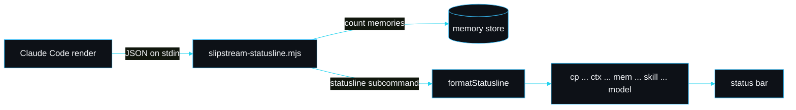

# Statusline

slipstream ships a statusline command that keeps the three things a token-disciplined session cares about in view at all times: how full the context budget is, how many durable memories the project has, and which skill or output style is active.

## What it shows

```
cp | ctx 12% ok | mem 4 | obs 37 | skill scoped-read | Opus 4.8
```

- `ctx 12% ok` the context budget: the percentage of the window used and the level (`ok`, `warn`, `COMPACT`).
- `mem 4` the count of durable, hand-authored memories in the project store.
- `obs 37` the count of auto-captured observations (dropped when the store is empty). See [Observation memory](Observation-Memory).
- `skill scoped-read` the active skill or output style, if any.
- `Opus 4.8` the model display name.

Segments with no data are dropped, so a fresh project shows a short line (`cp | ctx 0% ok`) rather than a row of zeros.

## How it is wired

The plugin declares a `statusLine` command in `.claude-plugin/plugin.json`:

```json
"statusLine": {
  "type": "command",
  "command": "node \"${CLAUDE_PLUGIN_ROOT}/statusline/slipstream-statusline.mjs\""
}
```

Claude Code invokes that script on each render and pipes a small JSON payload on stdin (workspace, model, cost). The script (`statusline/slipstream-statusline.mjs`) reads the payload, counts the project's memories, and calls the helper CLI's `statusline` subcommand, which formats the line through `formatStatusline` in `src/statusline/index.ts`. If `dist/` is missing it degrades to `cp | ctx 0% ok` rather than erroring, because a statusline must never crash the editor.



## Enabling it

If you install the plugin from the marketplace, the statusline is declared in the manifest and Claude Code picks it up. To set it manually, point your Claude Code statusline setting at the script:

```jsonc
// settings.json
"statusLine": {
  "type": "command",
  "command": "node /path/to/slipstream/statusline/slipstream-statusline.mjs"
}
```

## The formatting contract

`formatStatusline` is pure, so the test pins the exact string. With `bytesRead: 50000`, `memoryCount: 4`, `observationCount: 37`, `activeSkill: "scoped-read"`, `model: "Opus 4.8"` it returns exactly `cp | ctx 7% ok | mem 4 | obs 37 | skill scoped-read | Opus 4.8`. The budget level mirrors `src/context/budget.ts`: below 60% is `ok`, 60 to 85% is `warn`, above 85% is `COMPACT`.

## Failure modes

| Symptom | Cause | Fix |
|---|---|---|
| line shows `cp | ctx 0% ok` only | `dist/` not built, script degraded | `pnpm build` in the plugin |
| memory count always 0 | the project has no `.claude/slipstream/memory` yet | save a fact with `/slipstream:remember` |
| budget always 0% | Claude Code's payload did not include token usage | the budget is an estimate; see [Token efficiency](Token-Efficiency) |

## See also

- [Output style](Output-Style) for the terse style the `skill` segment can show.
- [Token efficiency](Token-Efficiency) for the budget the `ctx` segment reflects.
- [Configuration and tuning](Configuration-and-Tuning) for the window override.

---
SarmaLinux . sarmalinux.com . [Repository](https://github.com/sarmakska/slipstream)
