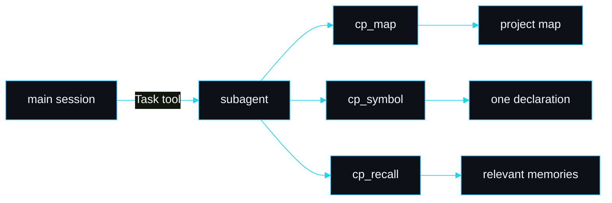

# Subagents

claudepilot ships three lean subagents under `agents/`. Each is a real Claude Code agent with frontmatter (`name`, `description`, `tools`), and each is token-disciplined: it works through the MCP tools (`cp_map`, `cp_symbol`, `cp_search`, `cp_recall`) rather than reading whole files. You delegate to them with the Task tool, for example "use cp-reviewer to check this before I push".

## cp-shipper

`agents/cp-shipper.md`. Takes a project from scaffold to a deployed site, running every verification gate as it goes.

It orients with `cp_map`, recalls prior stack decisions with `cp_recall` so it does not contradict an earlier call, and works in order: frontend scaffold, backend and data layer, integrations (auth, payments, email as required), then deploy. It treats each skill's `## Verify` block as a gate and runs it as a real command; a gate that exits non-zero blocks it until the cause is fixed. Durable decisions go to `cp_remember`, and it watches `cp_budget` so a long shipping run stays scoped.

**Use when** the user wants a site taken end to end with gates enforced, not just scaffolded.

## cp-schema

`agents/cp-schema.md`. Designs and migrates a Supabase / Postgres schema with row level security.

It recalls existing schema conventions first, designs tables with explicit foreign keys and indexes, writes the migration under `supabase/migrations`, and enables RLS on every table that holds user data. RLS is not optional: a table with RLS enabled and no policy denies all access, which is the safe default it starts from, then it adds the minimum policies the feature needs. It verifies by applying the migration and confirming RLS is on and an unauthorised query is denied.

**Use when** the user is adding or changing database tables and security matters.

## cp-reviewer

`agents/cp-reviewer.md`. A pre-push guardrail. It is read-only on the code: it reports, it does not fix.

It reads the diff (`cp_symbol` / `cp_lines` for changed declarations), runs the project gates (lint, build, tests) via Bash and captures each exit code, scans the diff for leaked secret shapes (`sk_live`, `ghp_`, AWS `AKIA...`, `KEY=`/`TOKEN=`, connection strings), and reviews the diff for correctness blockers. It ends with a verdict: `PASS` only if every gate exited zero, the secret scan is clean and no blocker was found; otherwise `FAIL` with one line per problem. A red gate blocks the push.

**Use when** you are about to commit or push and want a gate that refuses to wave through a broken change.

## Why they use the MCP tools

A subagent runs in its own context window. If it read whole files it would burn that window fast and the main session would never see the result. Working through scoped tools keeps each subagent cheap, which is what makes delegating to several of them practical.

## Failure modes

| Symptom | Cause | Fix |
|---|---|---|
| subagent does not appear | the plugin `agents/` did not ship | `/claudepilot:doctor` flags `subagents`; reinstall or `pnpm build` |
| subagent reads whole files anyway | the MCP server is not loaded | check `cp_map` is available; see [MCP tools](MCP-Tools) |
| cp-reviewer passes a broken change | the project gates are not the standard `pnpm` scripts | tell it the exact commands; it runs what the project defines |

## See also

- [MCP tools](MCP-Tools) for the tools the agents use.
- [Skill catalogue](Skill-Catalogue) for the skills cp-shipper drives.
- [Security model](Security-Model) for the secret scan cp-reviewer runs.

---
SarmaLinux . sarmalinux.com . [Repository](https://github.com/sarmakska/claudepilot)
